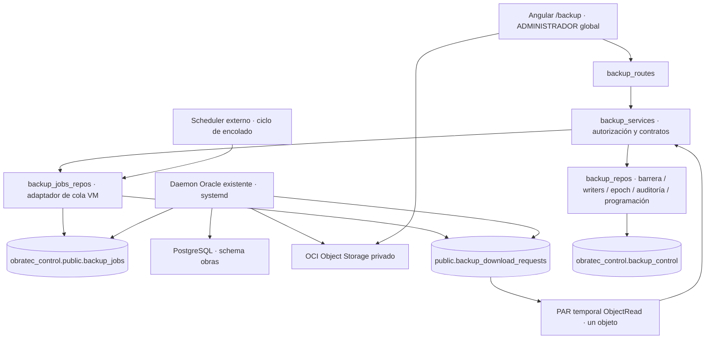
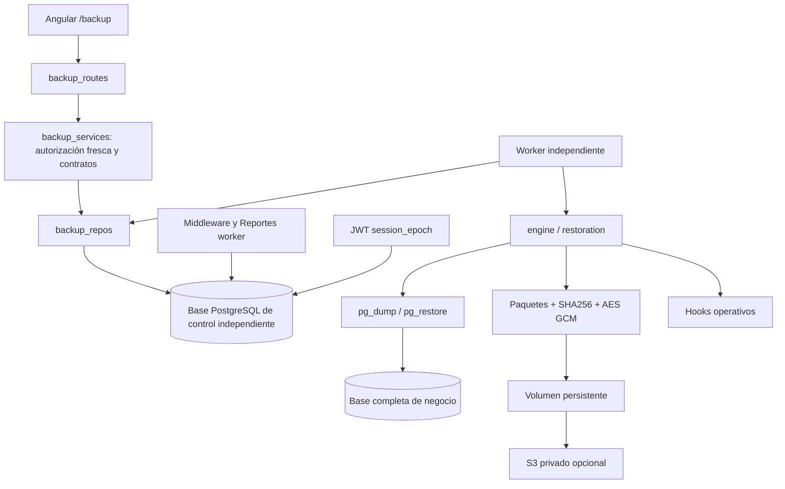

# Arquitectura de Backup/Restore

## Arquitectura vigente: Oracle VM (2026-10-05)

El motor es el **daemon existente** `/opt/obratec-backup/backup_service.py`, supervisado por `obratec-backup.service`. FastAPI solo autoriza/encola/consulta; pg_dump/pg_restore, PRE_RESTORE, integridad y OCI Instance Principal pertenecen exclusivamente a la VM. [Decisión y validación](decisiones/2026-10-05-integracion-backup-service-oracle.md) y [operación vigente](OPERACION_BACKUP_SERVICE_ORACLE.md).

Se preservan Service Layer, Repository funcional, Application Factory, middleware único y control independiente. ADMINISTRADOR global se reconsulta en negocio; ADMINISTRADOR_EMPRESA no administra copias. No hay filtro por tenant: el schema obras incluye todas sus empresas y excluye comercio. El dump custom no contiene evidencias o software; el motor anterior de paquetes/AES/releases deja de ser el flujo activo.

La cola mantiene ID BIGINT, tipos BACKUP/RESTORE/DELETE, orígenes MANUAL/AUTOMATICO/PRE_RESTORE y estados PENDIENTE/PROCESANDO/COMPLETADO/FALLIDO. FastAPI serializa IDs como strings para preservar precisión JavaScript. object_name/sha256/size_bytes proceden del daemon. job_relacionado_id mantiene PRE_RESTORE → RESTORE. Los eventos usan UUID5 del job para preservar recurso UUID en el diario y guardan el ID físico en detalle.

`20261005_backup_vm_integration.sql` añade únicamente una tabla auxiliar de idempotencia sin sustituir la cola/system_state. La programación se conserva: un despachador finito inserta ocurrencias en la misma cola, con revalidación de actor y transacción. No hay scheduler en el daemon o en cada proceso HTTP, ni un nuevo worker. Retención/DELETE pendientes.

RESTORE desde FastAPI queda bloqueado en código, conservando endpoints y reautenticación/confirmación. El flag legacy no habilita producción. El daemon mantiene obratec_restore_test2/protección contra obras, según confirmación del usuario, sin editar su archivo. Heartbeat y coordinación del daemon con barrera/writers quedan pendientes; un latido legacy no acredita disponibilidad. Importación legacy retirada: no hay FileResponse u operaciones OCI en FastAPI.

La [descarga PAR](decisiones/2026-10-05-descarga-backups-par-oci.md) reutiliza `public.backup_download_requests`, ya instalada por el operador y consumida por el daemon. FastAPI inserta solo job_id/solicitado_por para un BACKUP COMPLETADO conocido; la VM publica par_url/expira_en. POST `/ejecuciones/{id}/archivo` (GET compatible) devuelve 202 pendiente o 200 al completar; GET `/descargas/{id}` consulta exclusivamente solicitudes del administrador actual. Se reutilizan pendientes/enlaces vigentes del mismo actor bajo lock transaccional, sin UPDATE/DELETE, nuevas tablas ni workers. La capacidad de descarga se comprueba separadamente de creación de backups.

Solo se entrega PAR HTTPS de host `objectstorage.<región>.oraclecloud.com`, namespace/bucket configurados y objeto exactamente coincidente, con expiración vigente. URLs no aparecen en auditoría/errores; resultados usan no-store. Angular espera hasta dos minutos, limita cada petición a quince segundos, cancela seguimiento/navegación al salir y conserva el enlace solo en memoria hasta su vencimiento. El navegador accede directamente a OCI sin JWT; existe enlace alternativo con noreferrer/no-referrer. El usuario confirma PAR ObjectRead de diez minutos y bucket privado; la aplicación no genera ni prolonga su vigencia.

Los entrypoints worker/diagnósticos físicos legacy están bloqueados y sus adaptadores quedan desconectados de HTTP para retirada progresiva/revisión histórica. No se editó .env, se borraron claves/artefactos o se modificó el daemon. Flutter no tiene consumidores del módulo encontrados; Angular se adapta a IDs/estados/capacidades actuales conservando la pantalla.

La primera revisión de catálogo confirmó cola/constraints/PG17.11/puerto 5433 y encontró permisos de cola pendientes. Posteriormente el usuario confirmó BACKUP manual funcional (Job 7) y PAR generado (solicitud 2). La revisión actual de solo lectura confirma tabla de descargas, SELECT/INSERT, USAGE en secuencia y resultado COMPLETADO de esa solicitud con host/objeto esperados. El agente no aplicó migraciones/permisos ni generó solicitudes reales: ver resultados y límites en ambas decisiones.

## Implementación anterior: referencia histórica

Los apartados siguientes documentan el motor sustituido. AES/S3/discos/herramientas en Render y comandos del worker/restauración antigua ya no aplican a FastAPI. OPERACION_BACKUPS.md fue eliminado en el árbol del usuario; se conserva esa eliminación y se utiliza la operación Oracle enlazada arriba.

Fecha: 2026-10-04. [Plan anterior](PLAN_BACKUP_RESTORE.md) y [decisión histórica](decisiones/2026-10-04-implementacion-backup-restore.md).

Excepción autorizada para evidencias externas ausentes: [decisión](decisiones/2026-10-04-backup-base-evidencias-ausentes.md). `base_datos` permite capturarlas como referencias originales y registra los archivos ausentes en `evidencias_no_disponibles`, sin borrar registros. Su trabajo LISTO y metadata pública informan la omisión. `sistema_completo` mantiene la exigencia de archivos. La ausencia registrada impide certificar recuperación completa en el ensayo/promoción existente, aunque el artefacto PostgreSQL puede verificarse y descargarse. La nueva prueba real llegó a LISTO y verificó integridad/catálogo; las observaciones de bloqueo inicial del párrafo siguiente son históricas.

Prueba posterior al habilitar el entorno: [resultado real](PRUEBA_BACKUPS_UBUNTU_2026-10-04.md) y [corrección documentada](decisiones/2026-10-04-prueba-backups-configurados.md). Se confirmó conexión Ubuntu y control instalado. Se normalizan separadores Windows de referencias de evidencias en el límite de captura, sin cambiar los valores del inventario de base ni el parser estricto del paquete. Faltan tres archivos locales: no se obtuvo copia LISTO ni se ensayó/promovió restauración.

## Contexto y autorización

Contexto de despliegue confirmado por el usuario: acceso a la base mediante **Ubuntu Server**. No se infiere que backend/worker residan allí ni que la conexión sea directa o mediante SSH. El adaptador conecta a PostgreSQL por TCP; las herramientas se ejecutan y los paquetes se almacenan en el equipo del worker. Consultar [guía de habilitación](HABILITAR_BACKUPS_UBUNTU_SERVER.md) y [decisión documental](decisiones/2026-10-04-guia-backups-ubuntu-server.md). No se comprobó nuevamente la instancia ni se cambió configuración del servidor.

OBRATEC comparte PostgreSQL 17 entre tenants. Backup/Restore es global: afecta a todas las empresas y exige ADMINISTRADOR activo consultado nuevamente en negocio. La selección de empresa no modifica alcance ni permisos. El guard de `/backup` usa roles; el menú existente ya distingue al administrador global. No se modificó Flutter: no se encontraron pantallas móviles consumidoras del backup anterior.

Se reemplazaron SQL parcial en memoria y programación simulada por trabajos persistentes, archivos autenticados y restauración por etapas. El código está implementado; la configuración real, migración de control y ensayo de despliegue no se ejecutaron sobre el servidor actual.

## Capas y patrones

| Archivo/módulo | Responsabilidad |
| --- | --- |
| `routes/backup_routes.py` | API, dependencia global, importación binaria y descarga. |
| `services/backup_services.py` | Casos de uso, preflight, programación, confirmación y nueva autenticación. |
| `repos/backup_repos.py` | SQL parametrizado, cola, exclusión, leases, retención y eventos en control. |
| `services/backups/settings.py`, `contracts.py` | Configuración, límites, contratos cerrados y calendario IANA. |
| `postgres.py` | Snapshot exportado, inventario, herramientas oficiales, staging, promoción y cuarentena. |
| `packages.py`, `crypto.py`, `storage.py` | Inventario cerrado, límites, rutas seguras, cifrado y almacenamiento. |
| `coordination.py` | Barrera entre procesos y registro de escritores. |
| `engine.py`, `restoration.py`, `worker.py` | Captura, ensayos, copias preventivas y compensaciones. |
| `backup_worker.py`, `backup_recovery.py`, `migrate_backups.py` | Worker en primer plano, consola independiente y migración explícita. |

Se mantienen Service Layer y Repository funcional. Los adaptadores separan infraestructura de casos de uso; se incorporan cola durable, máquina de estados y diario con compensaciones. PostgreSQL/filesystem no comparten transacción. Cada promoción se registra PREPARADO/HECHO; una situación ambigua conserva mantenimiento y ambas generaciones para intervención.

## Control independiente y concurrencia

[20261004_backup_control.sql](../backend/database/20261004_backup_control.sql) crea siete tablas en otra base cuyo nombre debe diferir de Config.DB_NAME. No tiene FK hacia negocio y no se migra desde el arranque HTTP.

| Tabla | Contenido |
| --- | --- |
| `t_backup_control` | Mantenimiento, propietario, heartbeat y session_epoch. |
| `t_backup_programacion` | Programación global, actor y next_run. |
| `t_backup_ejecucion` | Idempotencia, origen, estado, etapa, lease y archivo. |
| `t_backup_archivo` | Ciphertext, huella, tamaño, manifiesto, key_id y protección. |
| `t_backup_restauracion` | Staging, desafío, confirmación, preventiva y diario. |
| `t_backup_evento` | Auditoría fuera de la base restaurada. |
| `t_backup_escritor` | Requests y worker de Reportes que deben drenarse. |

El claim se serializa con advisory lock corto y no permite dos promociones ni captura simultánea. La lease de 90 segundos se renueva cada 15. No hay transacciones de control abiertas durante I/O. Una interrupción en mantenimiento no lo libera automáticamente; escritores expirados se consideran inciertos hasta comprobar que terminaron.

El scheduler deduplica ocurrencias, recupera una reciente y registra períodos omitidos. La retención excluye archivos protegidos, restauraciones activas y la última copia con ensayo exitoso. Bases y releases preservados no se eliminan automáticamente.

## Captura y paquetes

La barrera registra todas las requests de negocio, incluidos GET heredados potencialmente mutantes, y el tick entero de Reportes. Bloquea nuevas solicitudes y drena existentes. Los endpoints de control siguen disponibles. Escritores externos, otros workers o SQL directo requieren coordinación operativa; BACKUP_EXTERNAL_WRITERS_COORDINATED declara que está realizada.

`pg_dump --format=custom --snapshot` usa el mismo snapshot REPEATABLE READ del inventario, sin filtro por esquema. Incluye ownership, ACL y large objects. El inventario compara tablas/conteos, columnas, funciones/procedimientos, triggers, constraints, índices, vistas, enums, RLS, permisos, secuencias y huellas de large objects. Conserva metadata de base, locale, owner, grants y settings para un staging compatible.

`sistema_completo` incluye base, backend/uploads y el release real backend/frontend, dependencias/migraciones y frontend/dist si existe. La huella representa archivos del checkout aunque esté sucio. Excluye .env, .git, claves privadas, dependencias instaladas y cachés. Flutter es un cliente externo; roles/tablespaces de clúster y secretos se aprovisionan separadamente.

El formato `.obratec` usa AES-256-GCM por chunks, nonce nuevo, cabecera autenticada y tag final. El parser solo recibe plaintext después de verificar el tag completo. ZIP se procesa por inventario, sin extractall; rechaza traversal, enlaces, duplicados y tamaños inconsistentes y comprueba SHA256. La copia se publica con rename tras verificar su descifrado; si S3 está configurado, la subida debe finalizar antes de LISTO.

## Restauración

1. Elegir/importar un paquete autenticado; la API no acepta SQL plano.
2. Restaurar a obratec_stage_<id> con stop-on-error, comparar inventario y evidencias. Solo-base exige que los archivos actuales coincidan.
3. Publicar VALIDADA con desafío de una hora y actor. Aplicar exige frase exacta y JWT distinto de nueva autenticación del mismo administrador, máximo cinco minutos.
4. Revalidar staging, preparar software/archivos en un directorio hermano y drenar. Crear y ensayar una copia preventiva protegida.
5. Detener servicios mediante hook, revocar sesiones, preservar base actual y promover staging. Mover archivos/software mediante renames en su mismo filesystem, con diario. El worker corre desde otra instalación y no sustituye secretos.
6. Pausar Reportes/programaciones restauradas y poner envíos pendientes en INCIERTO. Los efectos de Brevo no se revierten con datos antiguos.
7. Arrancar todas las réplicas, cerrar pools/cachés por reinicio completo y comprobar salud mediante hook. Después liberar mantenimiento. Fallos disparan compensación; ambigüedad conserva REQUIERE_INTERVENCION.

La consola permite reconstruir catálogo, ensayar, aplicar, compensar y revisar barreras sin login al negocio. `--disaster` omite la preventiva únicamente si la base original no existe, registrando la pérdida ya ocurrida. No permite omitirla de una base existente.

El ensayo periódico es opcional y desactivado. Al habilitarlo con staging designado, valida una copia reciente según intervalo y limpia sus recursos sin promoverla. Un ensayo manual conserva staging para confirmar o descartar explícitamente.

## API, UI y verificación

API `/api/backup`: estado, ejecuciones/listado/detalle/archivo, programación GET/PUT/PATCH, importaciones binarias, restauraciones/listado/detalle/validar/aplicar y reautenticación. GET/manual es deprecated: devuelve 202/trabajo y requiere Idempotency-Key; ya no retorna SQL en memoria.

Angular presenta estado operativo, requisitos, creación, calendario, historial paginado, descarga e importación/ensayo/confirmación. No usa porcentajes o éxitos simulados. Detiene polling al destruirse y borra contraseñas. El interceptor distingue BACKUP_REAUTH_FAILED del rechazo del bearer para no cerrar una sesión válida por contraseña incorrecta.

Pruebas aisladas y build ejecutados; resultados en la decisión. [Ensayo PostgreSQL desechable](../backend/tests/backups_disposable_check.py) preparado, no ejecutado sin clúster designado. Tampoco se promovió el servidor real ni se comprobó S3 contra una cuenta real: aceptar esos pasos requiere staging, hooks e infraestructura designados.

Fuentes: [pg_dump](https://www.postgresql.org/docs/17/app-pgdump.html), [pg_restore](https://www.postgresql.org/docs/17/app-pgrestore.html), [metadata PG17](https://www.postgresql.org/docs/17/catalog-pg-database.html), [cifrado](https://cryptography.io/en/latest/hazmat/primitives/symmetric-encryption/), [cryptography estable](https://pypi.org/project/cryptography/50.0.2/).
