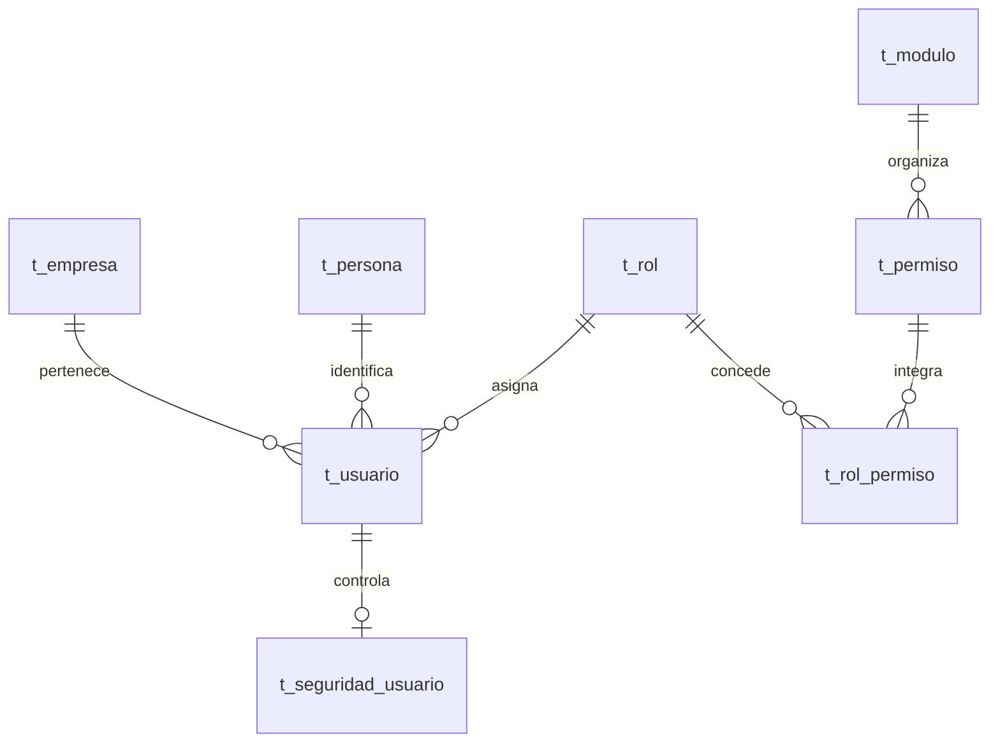
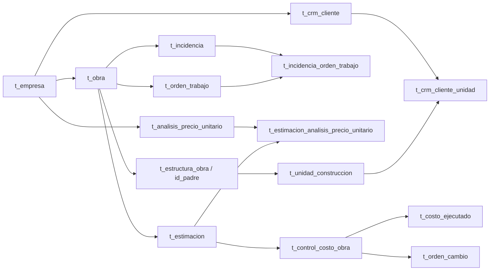

# OBRATEC: arquitectura de PostgreSQL, roles y objetos persistentes

Fecha: 2026-10-04 (America/La_Paz).

Contexto adicional comunicado por el usuario: el acceso a la base es a través de **Ubuntu Server**. La ubicación del backend/worker y el uso de conexión directa, SSH o contenedores no están confirmados. Esta aclaración no constituye una nueva inspección del servidor. Para respaldos remotos, consultar [guía de habilitación](HABILITAR_BACKUPS_UBUNTU_SERVER.md).

Comprobación posterior de backups: conexiones reales de solo lectura confirmaron PostgreSQL 17.11 en Ubuntu y las siete tablas de control presentes en `obratec_control`, independiente de `obras`. No se ejecutó migración en esta comprobación. [Resultado y límites](PRUEBA_BACKUPS_UBUNTU_2026-10-04.md); la declaración de migración preparada del párrafo siguiente corresponde a la entrega inicial.

Backup/Restore agrega una base de control independiente, sin FK a negocio, con siete tablas de jobs/archivos/restauraciones/eventos/programación/mantenimiento/epoch/escritores. [Migración preparada](../backend/database/20261004_backup_control.sql), no aplicada al servidor actual; no modifica objetos de obras. Un dump incluye todos los esquemas de negocio; roles/tablespaces de clúster se aprovisionan aparte. Ver [arquitectura](ARQUITECTURA_BACKUP_RESTORE.md) y [operación](OPERACION_BACKUPS.md).

Actualización de implementación: [20261004_reportes.sql](../backend/database/20261004_reportes.sql) ya se aplicó a la base configurada, agregando siete tablas de reportes/asistente, índices, constraints y cinco permisos. La revisión posterior confirma que no quedan tablas pendientes. El inventario enlazado conserva la fotografía histórica de 68 tablas previa a esta migración; sus conteos y matriz RBAC no describen los objetos/grants añadidos después. Consultar [arquitectura nueva](ARQUITECTURA_REPORTES_IA.md), [corrección aplicada](decisiones/2026-10-04-tablas-pendientes-reportes.md) y [operación](OPERACION_REPORTES.md) antes de modificar estos objetos.

## 1. Fuente de verdad y alcance

Este análisis complementa [ARQUITECTURA_Y_PATRONES.md](ARQUITECTURA_Y_PATRONES.md). Se debe consultar antes de modificar persistencia, consultas, roles, permisos, funciones, procedimientos, triggers o migraciones.

Se inspeccionó **la base configurada por el backend**, llamada `obras`, con PostgreSQL **17.11**, y se contrastó el esquema `obras` con `backend/database/*.sql`, repositorios y servicios Python. La configuración por sí sola no permite clasificar esta conexión como desarrollo o producción.

La inspección se hizo con `default_transaction_read_only=on`, timeout de conexión y consultas, y rollback al cerrar. El inventario principal se obtuvo en una transacción REPEATABLE READ; una segunda consulta de solo lectura completó columnas calculadas, ACL e índices. No se ejecutaron funciones de negocio, procedimientos, migraciones ni pruebas que escriban. Solo se consultaron catálogos estructurales y filas de roles, módulos y permisos; no se extrajeron usuarios, contraseñas ni datos de proyectos/clientes.

La fotografía no demuestra un historial de migraciones ni que todas las reglas se cumplan en los datos existentes. Es evidencia de objetos y configuración al momento de inspección. Para cambios futuros hay que volver a comprobar los objetos afectados.

### Referencias completas

- [BASE_DATOS_INVENTARIO.md](BASE_DATOS_INVENTARIO.md): las 68 tablas con sus 599 columnas, tipos, nullabilidad, defaults, columnas generadas, restricciones e índices; matriz real de permisos; roles PostgreSQL, triggers y secuencias.
- [BASE_DATOS_RUTINAS.md](BASE_DATOS_RUTINAS.md): firmas y definiciones reales de las 74 rutinas, con referencias textuales a Python y scripts SQL. Las definiciones se conservan como evidencia, no como script para reaplicar automáticamente.
- [decisiones/2026-10-04-analisis-base-datos.md](decisiones/2026-10-04-analisis-base-datos.md): alcance y validación de este trabajo.

## 2. Arquitectura observada

Es una base relacional compartida por tenants y por los módulos del monolito. Las tablas funcionales se agrupan en el esquema `obras`. El backend utiliza SQL explícito y funciones PostgreSQL; las reglas se distribuyen entre servicios Python, funciones PL/pgSQL, triggers y restricciones declarativas.

No hay una base o esquema independiente por empresa, ni políticas RLS. Las funciones reciben identificadores de empresa y los servicios los resuelven a partir de la sesión. Algunas funciones aceptan empresa NULL para omitir el filtro; ese comportamiento necesita autorización previa en el backend.

| Objeto verificado en `obras` | Cantidad |
| --- | ---: |
| Tablas ordinarias | 68 |
| Columnas | 599 |
| Funciones | 73 |
| Procedimientos | 1 |
| Funciones con retorno `trigger` (incluidas entre las funciones) | 25 |
| Triggers de usuario, habilitados | 38 |
| PK / FK / CHECK / UNIQUE | 67 / 138 / 91 / 20 |
| Índices | 177 |
| Secuencias | 64 |
| Políticas RLS / tablas con RLS | 0 / 0 |
| Roles funcionales / módulos | 8 / 6 |
| Registros de permisos / nombres distintos | 58 / 54 |

No se encontraron vistas, vistas materializadas, tablas particionadas ni tablas externas en este esquema. Tampoco enums o domains propios: los estados se representan principalmente con VARCHAR y CHECK. Las extensiones instaladas son `plpgsql` 1.0 y `unaccent` 1.1.

Las 316 restricciones están validadas y no son diferibles. Los 177 índices están marcados como válidos y listos. Esto verifica estado de catálogo, no suficiencia de índices ni rendimiento de consultas.

## 3. Roles PostgreSQL y roles del sistema: dos niveles distintos

### Roles del motor

Se observaron 17 roles PostgreSQL: 15 roles predefinidos `pg_*`, `postgres` y `devpoppy`. Solo `postgres` y `devpoppy` tienen LOGIN. `postgres` tiene SUPERUSER, CREATEDB, CREATEROLE, REPLICATION y BYPASSRLS. El rol conectado, `devpoppy`, tiene CREATEDB, pero no SUPERUSER, CREATEROLE, REPLICATION ni BYPASSRLS.

`devpoppy` es propietario del esquema y de las 68 tablas; puede usar y crear objetos en el esquema. La ACL explícita del esquema es NULL. En los grants visibles posee SELECT, INSERT, UPDATE, DELETE, TRUNCATE, REFERENCES y TRIGGER para las 68 tablas. No es un rol de runtime limitado a ejecutar funciones.

Hay EXECUTE para `PUBLIC` y el propietario en las 74 rutinas. Todas las rutinas inspeccionadas son **SECURITY INVOKER**, por lo que ejecutan con los privilegios del llamador. EXECUTE para PUBLIC no significa acceso HTTP anónimo: también importan LOGIN, conexión, USAGE del esquema, privilegios de tablas y controles del backend.

Las tres membresías observadas son las relaciones internas de `pg_monitor` con `pg_read_all_settings`, `pg_read_all_stats` y `pg_stat_scan_tables`. No se observaron roles PostgreSQL por empresa ni correspondencia uno a uno con los roles funcionales.

**Consecuencia arquitectónica:** la conexión de aplicación tiene capacidad amplia sobre todas las empresas. Las FK y los triggers validan algunas relaciones, pero no identifican automáticamente al usuario HTTP o su empresa autorizada. La seguridad por tenant depende de que el backend suministre y valide el contexto correcto.

### RBAC funcional

Las entidades de rol y permiso son **globales**: no contienen `id_empresa`. Un cambio de permisos de un rol puede afectar a usuarios de varias empresas. `t_rol_permiso` tiene PK compuesta `(id_rol, id_permiso)`, pero la tabla `t_permiso` no tiene UNIQUE sobre el nombre.

| ID | Nombre real | Asociaciones a permisos | Nombres distintos | Interpretación |
| --- | --- | ---: | ---: | --- |
| 1 | ADMINISTRADOR | 27 | 27 | El backend aplica bypass global en `exigir_permiso`; sus 27 asociaciones no limitan ese bypass. |
| 2 | CLIENTE | 1 | 1 | Solo `Visualizar_avances` en la matriz persistida. |
| 3 | ADMINISTRADOR_EMPRESA | 56 | 52 | Permisos amplios, con ámbito de empresa aplicado en servicios/repositorios. |
| 4 | JEFE DE OBRA | 58 | 54 | Tiene todos los nombres de permisos actuales; algunas rutas siguen exigiendo exclusivamente ADMINISTRADOR. |
| 5 | ELECTRICO | 0 | 0 | Hay excepciones específicas por actor/asignación, por ejemplo registro de incidencias. |
| 6 | PLOMERO | 0 | 0 | Mismo cuidado: ausencia de grants no equivale a imposibilidad de toda acción. |
| 7 | MAESTROALBAÑIL | 0 | 0 | Preservar nombre real y normalización usada en cada cliente/servicio. |
| 8 | ALBAÑIL | 0 | 0 | Acciones autorizadas por contexto específico deben revisarse en código. |

No existe un rol `SUPERVISOR_OBRA` en la tabla actual, aunque aparece en representaciones de permisos de los clientes. Tampoco se deben sustituir los nombres almacenados por etiquetas normalizadas sin revisar sus consumidores.

Los módulos registrados son `Modulo_usuarios`, `Modulo_inventario`, `Modulo_obras`, `Modulo_empresa`, `Modulo_crm` y `Modulo_presupuestos`. No son una lista exhaustiva de las rutas de la aplicación: varias capacidades se agrupan bajo esos módulos.

Los permisos `Aprobar_ordenes_compra`, `Recepcionar_ordenes_compra`, `Registrar_ordenes_compra` y `Visualizar_ordenes_compra` existen dos veces cada uno con IDs distintos. Son 58 registros y 54 nombres. La caché backend convierte nombres a un set, por lo que deduplica en evaluación; administrar o migrar por ID sigue requiriendo revisar ambas filas.

El backend obtiene permisos desde BD y mantiene caché de 120 segundos por proceso. Angular y Flutter tienen mapas locales adicionales: su matriz no garantiza coincidencia con esta fotografía. Particularmente, CLIENTE y trabajadores tienen representaciones locales distintas de sus asociaciones persistidas.

La referencia histórica CU19 del 2026-10-02 mencionaba que un jefe de obra no tenía permiso de cierre. **Actualmente el rol JEFE DE OBRA sí tiene `Cerrar_incidencias`.** Es evidencia del cambio de matriz entre fotografías, no una comprobación del actor individual o de una acción HTTP.

## 4. Modelo relacional por dominio

El inventario técnico incluye todas las tablas. Esta agrupación explica su responsabilidad y cómo recuperar el tenant.

| Dominio | Tablas actuales | Ámbito y relaciones |
| --- | --- | --- |
| Identidad y plataforma | `t_empresa`, `t_persona`, `t_usuario`, `t_seguridad_usuario`, `t_rol`, `t_permiso`, `t_rol_permiso`, `t_modulo`, `t_bitacora`, `notificacion` | Usuario tiene empresa; personas, roles y permisos son globales. Bitácora referencia usuario. Notificación conserva `nro_usuario` sin FK. |
| Obra y avance | `t_tipo_obra`, `t_obra`, `t_detalle_obra`, `t_obra_usuario`, `t_avance_obra`, `t_parametro_estimacion`, `t_obra_estimacion` | Obra tiene empresa; detalle, personal, avance y estimación inicial heredan por obra. Parámetro con empresa NULL sirve como configuración global. |
| Estructura y unidades | `t_estructura_obra`, `t_modelo_unidad`, `t_modelo_caracteristica`, `t_unidad_construccion`, `t_unidad_ambiente`, `t_unidad_caracteristica`, `t_unidad_personalizacion`, `t_unidad_seguimiento`, `t_unidad_material` | Modelo tiene empresa; unidad hereda por estructura → obra; relaciones a modelos/materiales requieren pertenencia compatible. |
| Materiales y proveedores | `t_categoria_material`, `t_unidad_medida`, `t_material_base`, `t_material`, `t_material_caracteristica`, `t_proveedor`, `t_proveedor_material` | Categorías, medidas y material base son catálogos compartidos; materiales y proveedores tienen empresa. |
| Equipamiento | `t_equipo`, `t_equipo_maquinaria`, `t_equipo_maquinaria_obra` | Catálogo de equipo para costos y activos/asignaciones de maquinaria son entidades distintas, con empresa en las entidades raíz. |
| Compras e inventario | `t_orden_compra`, `t_orden_compra_detalle`, `t_recepcion_compra`, `t_recepcion_compra_detalle`, `t_materiales_almacen`, `t_movimiento_almacen` | Orden y recepción tienen empresa; detalle hereda del padre; lote hereda del material; empresa de movimiento admite NULL. |
| APU y estimaciones actuales | `t_analisis_precio_unitario`, `t_analisi_precio_unitario_insumo`, `t_mano_obra`, `t_estimacion`, `t_estimacion_analisis_precio_unitario` | APU, insumo, mano de obra y estimación tienen empresa; partidas enlazan estimación y APU. |
| Costos y cambios CU17 | `t_control_costo_obra`, `t_costo_ejecutado`, `t_orden_cambio`, `t_orden_cambio_detalle`, `t_orden_cambio_historial` | Línea base referencia una estimación aprobada. Costos y orden repiten empresa/obra y usan triggers para coherencia. |
| Presupuestos antiguos y archivos | `t_presupuesto`, `t_partida_presupuesto`, `t_costo_ejecutado_legacy`, `t_apu_legacy_archive`, `t_apu_detalle_mano_obra_archivo` | Subsisten presupuestos y partidas antiguos; APU antiguo fue retirado. Archivos JSONB conservan datos fuera de relaciones operativas. |
| Órdenes de trabajo | `t_orden_trabajo`, `t_orden_trabajo_usuario`, `t_orden_trabajo_permiso`, `t_usuario_orden_trabajo_permiso` | OT deriva empresa por obra; responsables y permisos de OT tienen relaciones propias. `id_obra` de OT admite NULL. |
| Incidencias | `t_incidencia`, `t_incidencia_seguimiento`, `t_incidencia_evidencia`, `t_incidencia_orden_trabajo` | Empresa por obra; relación M:N incidencia/OT validada además por trigger de misma obra. |
| CRM | `t_crm_cliente`, `t_crm_interaccion`, `t_crm_cliente_unidad` | Cliente comercial tiene empresa y persona; interacciones/asociaciones heredan empresa desde cliente. |

### Relaciones centrales

El diagrama muestra dependencias funcionales principales; la lista de FK exactas, acciones de borrado y nullabilidad está en el inventario.

## 5. Patrones de modelado y aislamiento

### Tenant directo, heredado y catálogos globales

Veinte tablas contienen `id_empresa`, incluida `t_empresa`. Tener esa columna no implica aislamiento automático: hay tablas que repiten empresa junto a referencias a obra/material/usuario y podrían ser incoherentes sin validación adicional.

Tablas sin empresa directa pueden ser legítimamente tenant: incidencias, estructuras, unidades, OT, partidas, lotes y asociaciones requieren joins al padre correcto. Otras son catálogos globales. Los archivos históricos JSONB y la tabla de notificaciones requieren tratamiento particular, pues no todos tienen una cadena de FK suficiente para derivar autorización.

No se identificaron FK compuestas de tenant que garanticen de forma uniforme `(id_empresa, id_recurso)` en todo el modelo. Se usan FK simples, y en áreas concretas funciones/triggers verifican coherencia. Un FK a usuario/material/obra existente no demuestra que pertenezca al mismo tenant.

### Patrones presentes

- **Lista de adyacencia:** `t_estructura_obra.id_padre` y APU con `id_padre`. Mantener pertenencia al mismo proyecto y prevenir ciclos en la capa que corresponda; una FK al padre solo asegura existencia.
- **Relaciones M:N:** rol–permiso, obra–usuario, OT–usuario, incidencia–OT y proveedor–material. Varias usan PK compuesta; otras usan una PK artificial.
- **Catálogo global y adaptación por empresa:** `t_material_base` frente a `t_material`; `t_parametro_estimacion.id_empresa` NULL frente a parámetros específicos.
- **Snapshots de valores monetarios:** partidas de estimación, estimación paramétrica inicial y detalles de órdenes de cambio. No equivalen a congelar toda entidad relacionada, ni implican inmutabilidad completa por sí mismos.
- **Estados con integridad declarativa:** VARCHAR + CHECK, complementados por servicios y triggers para transición/actor. El CHECK de estados no controla por sí mismo la secuencia de transiciones ni quién las solicita.
- **Auditoría y anulación:** costos conservan anulador, fecha y motivo; historial de cambios es append-only por trigger; otros historiales no necesariamente tienen esa misma protección.
- **Archivos de evolución:** JSONB para preservar registros retirados. No reintroducir tablas operativas antiguas solo porque sus datos archivados existen.

## 6. Funciones y procedimiento: contratos reales

El prefijo `sp_` **no significa PROCEDURE**. En esta base las rutinas `sp_*` de login y obras son funciones y se invocan con SELECT. El único procedimiento es `p_registrar_usuario`, y su invocación corresponde a CALL. No se encontró una llamada a este procedimiento en el backend revisado; el registro actual inserta mediante `auth_repos.py`.

El catálogo completo conserva firmas exactas. Deben revisarse tipos, orden de argumentos, defaults, retorno y manejo de errores antes de cambiar cualquier consumidor.

| Familia | Rutinas representativas | Responsabilidad y límite |
| --- | --- | --- |
| Autenticación | `sp_login_usuario`, `sp_registrar_intento_fallido`, `sp_login_exitoso` | Identificación, estado de seguridad, bloqueo y dispositivos. Login puede insertar/reiniciar seguridad: no es una lectura pura. El hash se devuelve al backend, no se leyó durante esta inspección. |
| Registro | `p_registrar_usuario` | Inserta persona y usuario, comprueba correo/CI existente y almacena el argumento password recibido; no realiza hash internamente. |
| Obras y personal | `sp_registrar_obra`, `sp_actualizar_obra`, `sp_actualizar_estado_obra`, `sp_listar_obras`, `sp_obtener_obra_detalle`, `sp_asignar_responsable_obra`, `sp_retirar_responsable_obra` | Reglas y respuestas JSON, pertenencia y personal de obra. Varias aceptan contexto global mediante empresa NULL. |
| Estructura y unidad | `fn_*_estructura_obra`, `fn_registrar_unidad_construccion`, `fn_actualizar_unidad_construccion`, `fn_cambiar_estado_unidad`, `fn_eliminar_unidad_construccion` | Composición de estructura, unidad, ambientes, características e historial. Cambio de estado y eliminación de unidad incluyen locks explícitos. |
| Avances | `fn_registrar_avance_obra`, `fn_eliminar_avance_obra`, `fn_listar_avances_obra`, `fn_resumen_avances_obra` | Conviven avance registrado por unidad y avance derivado de OT. Revisar firma y entidad devuelta. |
| Materiales | `fn_registrar_material`, `fn_modificar_material`, `fn_consultar_material`, `fn_listar_materiales_empresa`, `fn_desactivar_material`, `fn_copiar_catalogo_base_empresa` | Recursos por empresa, catálogo base y estados. No confundir una copia con una actualización sincronizada de todas las empresas. |
| Compras y recepción | `fn_registrar_orden_compra`, `fn_cambiar_estado_orden_compra`, `fn_aprobar_rechazar_orden_compra`, `fn_registrar_recepcion_compra`, funciones de número/listado/detalle | Orden, detalle, recepción, stock y movimientos se relacionan en una operación. Recepción requiere orden aprobada/parcial y cantidad pendiente compatible. |
| Inventario | `fn_listar_inventario_empresa`, `fn_resumen_kpis_inventario`, `fn_registrar_ajuste_inventario`, `fn_listar_movimientos_almacen` | Ámbito por material/empresa, cálculo de stock y movimientos. Ajuste hace lectura y escritura de saldo; revisar concurrencia. |
| Cálculo APU/estimación | `fn_calcular_analisis_precio_unitario`, `fn_calcular_estimacion`, funciones de sincronización/snapshot/recalculo | Cálculos con NUMERIC, snapshots y totales. Preservar la diferencia entre precios actuales del APU y precios copiados a la estimación. |
| Integridad CU17 | `fn_cu17_validar_*`, `fn_cu17_*_solo_pendiente`, `fn_cu17_historial_append_only`, `fn_cu17_impedir_borrado_costo` | Refuerzo de coherencia, estados editables, conservación de historial y anulación de costos. |
| Auditoría y timestamps | `fn_registrar_bitacora`, funciones `fn_*updated_at*` | Registro explícito de acciones y actualización automática de fechas. Actualizar timestamp no equivale a auditar cambios completos. |

### Sobrecarga de avances

`fn_listar_avances_obra(integer, integer, varchar)` devuelve OT con su estado y peso porcentual; `fn_listar_avances_obra(integer, integer, integer)` devuelve avances registrados, filtrables por unidad. Ambas tienen un tercer argumento con default NULL. Un SELECT con dos argumentos o un NULL sin tipo puede ser ambiguo. Esta inspección confirmó ambas definiciones; no ejecutó llamadas para probar la resolución de overload.

## 7. Triggers y columnas calculadas

Los 38 triggers propios están habilitados. No se incluyeron triggers internos que PostgreSQL genera para FK.

### Costos y trazabilidad

- `fn_cu17_validar_linea_base` exige estimación APROBADA de la misma obra/empresa y copia versión y moneda.
- `fn_cu17_linea_base_identidad_inmutable` impide cambiar empresa, obra o estimación de una línea base existente. No es una garantía de inmutabilidad completa de todas las tablas de estimación.
- `fn_cu17_validar_costo` verifica control activo, empresa, obra y partida exacta de la estimación base.
- `fn_cu17_validar_orden` y `fn_cu17_validar_detalle_orden` verifican correspondencia con control, estimación y APU.
- Los triggers de orden/detalle restringen modificación según estado PENDIENTE.
- El trigger de costo impide DELETE; la ruta funcional esperada es anulación. El historial de orden impide UPDATE/DELETE ordinarios.

Son defensas valiosas ante SQL directo; todavía hay que revisar qué columnas activan cada trigger y qué operaciones del propietario podrían desactivarlos o evitarlos.

### APU y estimaciones

- `subtotal` del insumo es GENERATED ALWAYS con `round(cantidad * precio_unitario, 2)`.
- `precio_total` de partida es GENERATED ALWAYS con `round(cantidad * COALESCE(precio_unitario, 0), 2)`.
- `fn_sync_apu_precio` genera código y recalcula costo de materiales, costo directo y precio final usando mano de obra y porcentaje de utilidad.
- Al cambiar insumos, `fn_recalcular_apu_materiales` actualiza el APU. Si se mueve un insumo entre APU, revisar ambos padres: la definición toma OLD para DELETE y NEW para las otras operaciones.
- `fn_snapshot_precio_partida` completa valores monetarios faltantes desde APU de la misma empresa y genera código de ítem.
- `fn_recalcular_monto_estimacion` mantiene el monto a partir de las partidas.

Una modificación del catálogo APU no debe reescribir sin decisión explícita los precios históricos ya copiados. Revisar qué valores son snapshot y cuáles se siguen consultando en vivo, como nombres/unidades en `fn_calcular_estimacion`.

### Incidencias y estructura

`fn_validar_incidencia_ot_cu19` exige la misma obra entre incidencia y OT. Se ejecuta sobre INSERT/UPDATE del vínculo; cambiar después la obra de una entidad padre requiere revisar esa invariante, pues el trigger del vínculo no se dispara automáticamente.

`fn_proteger_unidades_estructura` protege el borrado de estructura con unidades. El estado de incidencia acepta PENDIENTE_VALIDACION y sus CHECK exigen fechas coherentes. La transición y autorización del actor siguen en `incidencia_services.py`, no en un trigger de máquina de estados.

Existen dos triggers de updated_at sobre `t_material`: el de CU14 y el de refactor. Ambos son reales y están habilitados; revisar su redundancia si se trabaja esa tabla.

## 8. Restricciones, índices y borrado

Las PK/FK aseguran existencia y relaciones; CHECK valida rangos/estados/coherencia de una fila; UNIQUE e índices parciales impiden duplicidad en ámbitos específicos.

Ejemplos relevantes:

- Material: UNIQUE `(id_empresa, codigo)`; proveedor: unicidad de NIT por empresa.
- CRM: UNIQUE `(id_empresa, id_persona)`; índices parciales impiden dos reservas/ventas activas de una unidad y asociaciones activas duplicadas del mismo cliente/unidad.
- Control de costos: índice parcial de una línea base ACTIVA por `(id_empresa, id_obra)`.
- Costo: `monto = round(cantidad * costo_unitario, 2)` y campos de anulación coherentes con el estado.
- Orden de cambio: código único por empresa/obra, campos de decisión y snapshots obligatorios.
- Parámetros: índice único con `COALESCE(id_empresa, 0)` para cubrir configuración global NULL.

Una tabla carece de PK: `t_usuario_orden_trabajo_permiso`; tampoco tiene UNIQUE en el catálogo inspeccionado. Sus FK no impiden asociaciones duplicadas. `notificacion` tiene PK, pero no FK a usuario o referencia de negocio.

La ausencia de `idx_apu_obra` en `t_analisis_precio_unitario` se confirmó: el SQL de creación lo define, pero no está en la base actual. No se midió si un índice adicional es necesario con la carga real. `t_estimacion` no tiene unicidad de versión por obra en sus índices actuales; generación de versión con MAX+1 requiere revisar concurrencia.

Borrado es heterogéneo: CASCADE en composiciones/hijos, RESTRICT en referencias de historial/recursos y SET NULL en relaciones opcionales. En particular, `t_bitacora.id_usuario` tiene **ON DELETE CASCADE**, de modo que el historial global no es intrínsecamente permanente al eliminar usuarios. Costos e historial de órdenes tienen protecciones más estrictas.

No se deben aplicar reglas generales de borrado sin revisar todas las FK y triggers del recurso: una empresa no se elimina igual que una categoría, unidad, OT o costo.

## 9. Diferencias confirmadas entre base, scripts y backend

| Hallazgo | Evidencia y consecuencia | Revisión necesaria al modificar |
| --- | --- | --- |
| APU antiguo ausente, consumidor todavía registrado | `t_apu`, `t_apu_componente` y `t_categoria_apu` no existen. `presupuesto_repos.py` aún consulta las primeras dos; routers de presupuesto siguen registrados. | Identificar ruta/pantalla afectada y migrar consumidor o retirar compatibilidad mediante decisión expresa. No recrear tablas retiradas por defecto. |
| Columna antigua retirada | `t_partida_presupuesto` no tiene `id_apu`; el repositorio antiguo la selecciona/inserta. | Compatibilidad requiere revisar columnas, no solo existencia de la tabla padre. |
| Nombre reutilizado para costos actuales | `t_costo_ejecutado` tiene estructura CU17; `t_costo_ejecutado_legacy` conserva la estructura anterior. El repositorio de presupuesto antiguo escribe columnas anteriores en el nombre actual. | No redirigir escrituras al archivo histórico ni mezclar anulación CU17 con DELETE antiguo. |
| Umbral de bloqueo divergente | `sp_registrar_intento_fallido` bloquea al llegar a 5; `auth_services.py` informa bloqueo desde 3 intentos. | Unificar la regla y validar el flujo completo cuando se trabaje autenticación. La divergencia se comprobó por definición, sin intentar logins. |
| Matriz amplia de JEFE DE OBRA | Tiene los 54 nombres de permiso, incluso capacidades administrativas; ciertas rutas exigen rol global y otras solo permiso. | Revisar alcance por acción y pertenencia. No suponer que el nombre de rol limita las capacidades por sí mismo. |
| Permisos duplicados | Cuatro nombres de compra tienen dos IDs; `t_permiso` no restringe unicidad del nombre. | Conservar asociaciones durante cualquier deduplicación; revisar scripts y cache. |
| Rol CLIENTE y mapas locales divergentes | BD concede solo Visualizar_avances; clientes también representan permisos como Visualizar_obras. | Contrastar intención, guard y autorización real de cada endpoint. |
| Supervisor de detalle referencia persona | FK de `t_detalle_obra.id_supervisor` e `id_cliente` apunta a `t_persona`, no a `t_usuario`. | No pasar un id_usuario suponiendo que es id_persona aunque coincidan valores en ejemplos. |
| CRM no coincide con el SQL inicial | CHECK actual permite NEGOCIACION, RESERVADO, VENDIDO y estados adicionales de cliente frente al script CU21 original. | Tomar definición real como punto de partida y versionar cualquier nuevo cambio. |
| Faltan definiciones base en SQL revisados | Funciones de login, creación/actualización de obra, bitácora, varios avances y el procedimiento existen sin CREATE localizado en los SQL disponibles. | El repositorio no demuestra una instalación completa reproducible. Las definiciones capturadas ayudan, pero no sustituyen un baseline probado. |
| Ausencia de índice definido en script | `idx_apu_obra` no está presente. | Comprobar divergencia y carga antes de diseñar corrección. |
| Sobrecarga de avances | Dos firmas con tercer argumento de diferente tipo y default NULL. | Usar firma explícita y revisar resultado esperado. |

El rastreo textual de nombres de rutinas invocadas desde Python no encontró nombres ausentes de la base. **No prueba compatibilidad de firmas, columnas o semántica**: los conflictos anteriores existen aunque todas las funciones nombradas estén creadas.

## 10. Transacciones, concurrencia y ejecución

Las escrituras de una función y sus triggers participan en la transacción del llamador. La atomicidad entre módulos depende de si los repositorios comparten conexión y de cuándo hacen commit. No existe una Unit of Work general del backend y no debe suponerse que la bitácora forma parte de la misma transacción que cada operación.

Se identificó FOR UPDATE en las funciones de cambio de estado y eliminación de unidades. Recepción de compras y ajuste de inventario combinan lectura/cálculo/escritura sin ese bloqueo explícito en sus definiciones revisadas. Correlativos de compra usan conteo/comprobación, y estimaciones usan MAX+1 en repositorio: las restricciones de unicidad y las transacciones no equivalen a reservar un correlativo antes de dos solicitudes concurrentes. Revisar estas rutas con pruebas de concurrencia cuando el pedido las afecte; aquí no se reprodujo un conflicto.

El rol propietario puede crear/modificar objetos. Evaluar un rol de runtime más limitado si se aborda endurecimiento de seguridad, manteniendo otro para migraciones. No implementar ese cambio automáticamente: puede afectar funciones, DML de repositorios y operación existente.

## 11. Ruta obligatoria para cambios de base

1. Leer este análisis, el inventario pertinente y la referencia de arquitectura general.
2. Rastrear ruta → servicio → repositorio → firma SQL → tablas/triggers/restricciones reales. Revisar consumidores Angular y Flutter cuando cambie el contrato.
3. Registrar el análisis previo en Markdown: objeto actual, regla que debe cambiar, patrón, tenant, permisos, historial y alcance.
4. Comprobar definición real y migraciones aplicadas. No ordenar scripts solo por nombre ni ejecutar `run_migration.py` suponiendo que actualiza toda la base: apunta específicamente a CU15.
5. Diseñar cambio incremental con compatibilidad, validación previa de datos y plan de reversión según el riesgo. Revisar locks, cascadas, snapshots y operaciones históricas.
6. Separar verificación de lectura, pruebas aisladas y cambios reales. Para probar una función potencialmente mutadora no basta usar SELECT: inspeccionar antes su cuerpo y estrategia de transacción.
7. Tras el cambio autorizado, comparar catálogo afectado, comprobar contratos y permisos/tenants relevantes y actualizar estos `.md`.

No se realizaron reparaciones de esquema ni modificaciones de permisos en este trabajo. Los hallazgos son contexto para ejecutar cambios coherentes con el sistema actual.
