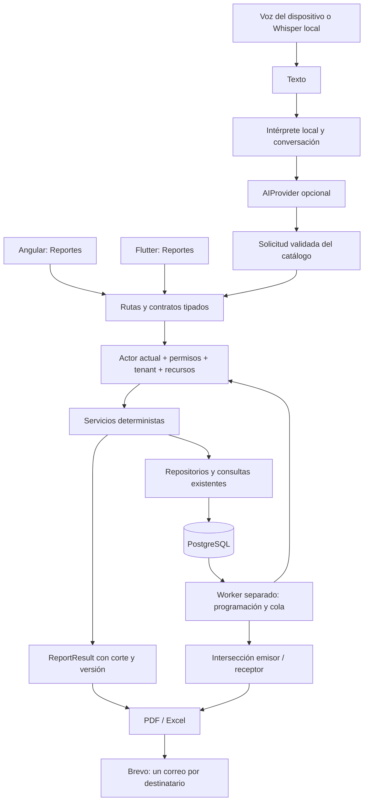

# Arquitectura implementada de Reportes, IA y automatización

Actualización web 2026-10-05: [decisión de navegación y rendimiento](decisiones/2026-10-05-frontend-navegacion-rendimiento.md). Familias del sidebar filtran el catálogo autorizado existente. Historial/programaciones/destinatarios se cargan bajo demanda. El shell conserva un asistente único para consulta rápida, burbuja y `/asistente`; cambiar modo conserva conversación y cambiar empresa/obra invalida respuestas anteriores. No cambian queries, proveedores, permisos, payloads ni automatización del backend.

Secuencias del flujo web y backend actual: [CU25 CRM, CU26 Asistente Inteligente y CU27 Reportes](DIAGRAMAS_SECUENCIA_CU25_CU26_CU27.md). Los diagramas distinguen consultas síncronas, exportación y cola de entregas, incluyendo contexto de actor/empresa y los límites de las excepciones SQL actuales.

Coordinación Backup/Restore: el tick entero del worker de Reportes participa en la barrera independiente de [Backup/Restore](ARQUITECTURA_BACKUP_RESTORE.md). Durante mantenimiento no genera ni envía. Desde 2026-10-05, Backup utiliza el daemon Oracle existente; RESTORE desde FastAPI está bloqueado y aún debe integrarse la coordinación del daemon con esa barrera. La pausa/cuarentena INCIERTO documentada para la restauración legacy no se presupone ejecutada por el daemon actual: Brevo no revierte efectos externos. No iniciar Reportes sin control operativo cuando BACKUP_ENABLED está activado.

Fecha: 2026-10-04. La migración `20261004_reportes.sql` ya se aplicó a la base configurada: comprobación posterior sin tablas de Reportes pendientes. Este documento complementa la arquitectura general y el inventario histórico de 68 tablas anterior a incorporar las siete nuevas. El worker no se inició durante esta corrección.

## Responsabilidades y patrones

Se conserva `routes → services → repos → PostgreSQL`. `reportes_routes.py` valida contratos Pydantic y autenticación. `reportes_services.py` ejecuta casos de uso, autorización, cálculos Decimal y coordinación de exportadores. `reportes_repos.py` contiene las consultas de negocio y las operaciones de persistencia/cola; los servicios y el worker no contienen SQL.

Instalación incompleta: el contexto transaccional traduce `UndefinedTable` únicamente para las siete tablas propias a `ReportesSchemaMissing`, una excepción compartida de infraestructura. La fábrica registra un handler HTTP 503 con código `REPORTES_SCHEMA_MISSING` y guía de migración. Conserva cierre/rollback; otros errores de tablas se propagan sin etiquetarse como instalación de Reportes. No hay migraciones automáticas desde solicitudes HTTP. Ver [corrección y validación](decisiones/2026-10-04-tablas-pendientes-reportes.md).

El registro `services/reportes/catalog.py` es el catálogo único de capacidades. Cada definición declara identificador, permiso, descripción, sinónimos, soporte de fechas y necesidad de obra. Incorporar una nueva métrica requiere actualizar su definición, consulta autorizada, cálculos y pruebas; cambiar el modelo IA no requiere hacerlo.

Patrones introducidos: registro de capacidades, contexto autorizado explícito, adaptadores de proveedor y exportación, conversación persistida y cola de trabajos con leases. La coordinación transaccional es específica del módulo, mediante `repo.transaction()`, sin una Unit of Work general para toda la aplicación. El almacenamiento inicial es BYTEA detrás de operaciones de repositorio; todavía no hay un adaptador de object storage.

## Catálogo y fuentes

| Capacidad | Fuente | Límite semántico |
| --- | --- | --- |
| `presupuestario` | `t_estimacion` + obra | Una fila por versión; no sumar versiones ni monedas distintas. |
| `comparativo_costos` | Consulta `comparacion_por_obra` de CU17, reutilizada con conexión opcional | Obra obligatoria y línea base ACTIVA. Acumulado actual, sin rango temporal. |
| `stock` | `fn_listar_inventario_empresa`, sin paginación de descarga | Existencias actuales de la empresa. |
| `consumo_materiales` | Movimientos SALIDA vinculados a OT de la empresa | Salidas registradas; no consumo físico comprobado ni ajustes de almacén. |
| `asignacion_personal` | `t_obra_usuario`, usuario/persona/rol | Asignaciones registradas; sin teléfonos, correo ni documentación personal. |
| `utilizacion_personal` | `t_orden_trabajo_usuario` + OT | Carga por OT; no horas, disponibilidad ni productividad. |
| `avance_ejecutivo` | Último avance físico por unidad | Promedio de unidades con registro, sin ponderación; cantidad sin avance separada. |
| `estado_unidades` | Unidad → estructura → obra | Estado actual, sin reconstrucción histórica. |
| `incidencias` / `incidencias_criticas` | Incidencia → obra | Rango de creación y prioridad CRITICA cuando corresponde. |
| `costos_periodo` | Costos CU17 REGISTRADO y línea base ACTIVA | Rango inclusivo por fecha del costo, con totales por obra/moneda separados. |
| `saldo_comercial` | Asociaciones CRM VENDIDO/ENTREGADO y costos CU17 | Saldo estimado actual; requiere permisos de ambos dominios. No demuestra cobros ni ganancias reales. |

HU110: recomendaciones deterministas ante costo ejecutado superior al presupuesto revisado. Un saldo menor no acredita ahorro. HU111: déficit respecto al mínimo de stock; se descuentan cantidades pendientes de compras APROBADA/RECIBIDA_PARCIAL cuando el actor tiene `Visualizar_ordenes_compra`. No se optimizan proveedores/precios ni se inventa demanda futura. Las recomendaciones registran ese permiso adicional y la descarga lo vuelve a exigir. En envío también se intersectan los permisos de las fuentes.

## Autorización de actores

La identidad proviene de `nro_usuario` del JWT firmado. Se recargan estado, empresa, persona, rol y permisos directamente de PostgreSQL, sin usar la caché de roles para este módulo. `ADMINISTRADOR` requiere empresa explícita y existente; no hay fallback a empresa 1. Los demás actores solo operan en su empresa actual.

| Actor | Ámbito |
| --- | --- |
| ADMINISTRADOR | Empresa seleccionada expresamente; bypass de permisos de acción, nunca consulta global implícita. |
| ADMINISTRADOR_EMPRESA | Recursos de su empresa, según permisos del dominio. |
| JEFE DE OBRA | Obras asignadas directamente o por OT; el stock empresarial se reserva a administración de empresa/plataforma. |
| CLIENTE | Avance y unidades de obras cuyo `t_detalle_obra.id_cliente` coincide con `t_usuario.id_persona`. No se usa CRM, nombre ni correo para ampliar acceso. La relación actual concede la obra completa; no demuestra titularidad individual de cada unidad. |
| Trabajador | Obras asignadas; solo sus filas de asignación/OT y las incidencias registradas por él o a su cargo. No obtiene personal de terceros. |

La migración concede consulta/exportación a clientes y trabajadores, y las cinco acciones a administración. Jefe obtiene consulta/exportación/envío/programación propios. No se conceden permisos nuevos de dominios financieros o inventario a cliente/trabajador.

Una ejecución conserva actor, política de rol/persona y obras autorizadas. Consultar/exportar/descargar recarga autorización, exige propiedad de la ejecución y verifica que sus obras continúen accesibles. Si cambia la política, se exige una nueva generación. El administrador no obtiene descargas de ejecuciones de otros actores por conocer el UUID.

El directorio de envío contiene IDs y nombres de cuentas activas de la empresa. No permite correos arbitrarios ni CC. La base no tiene un indicador canónico de correo verificado: se utiliza el correo configurado de la cuenta; verificar direcciones antes de activación operativa sigue siendo un requisito del entorno.

## Cortes, exportación y límites

La lectura utiliza REPEATABLE READ / READ ONLY. El comparativo acepta la conexión de esa transacción; no cambia contratos de consumidores anteriores. El corte es `transaction_timestamp()`, versión de resultado 1 y solicitud normalizada persistida en JSONB. NUMERIC se conserva como Decimal durante cálculo y como cadena decimal en JSON; el LLM nunca calcula totales.

PDF y XLSX se generan a partir del mismo resultado guardado. Excel contiene Resumen, Filtros y Detalle, incluyendo recomendaciones; valores numéricos y fechas tipados, horas en UTC. Se neutralizan prefijos de fórmula y caracteres XML inválidos. PDF escapa markup, repite cabeceras y divide columnas en bandas sin omitir campos.

Límites actuales: 20.000 filas; 5 MiB por archivo y por conjunto de adjuntos; PDF rechaza celdas mayores a 2.000 caracteres, ofreciendo Excel; Excel rechaza texto sobre su límite de 32.767 caracteres. Se rechaza explícitamente el volumen excesivo, sin truncar registros. Los reportes manuales/exportaciones son síncronos dentro de estos límites; la generación de programaciones y el envío son asíncronos. Aún no hay trabajos de exportación masiva ni enlaces de descarga para adjuntos mayores.

Archivos: retención de 7 días; resultados: 30 días; conversación: 30 días desde creación. El worker elimina archivos/conversaciones vencidos y vacía resultados antiguos conservando metadatos de ejecución/envío. Estos límites están fijados en la primera implementación; hacerlos configurables requiere cambiar las políticas de persistencia.

## Programación, cola y entrega

Las siete tablas nuevas se describen en la migración `20261004_reportes.sql`. No contienen JWT ni credenciales. Se preservan FK restrictivas e historial al pausar programaciones; se deduplican programación/ocurrencia y entrega/receptor mediante UNIQUE.

`reportes_worker.py` es un proceso independiente. No se registra un scheduler en cada Uvicorn. El claim usa `FOR UPDATE SKIP LOCKED` y commits cortos; generación, exportación y Brevo ocurren fuera de locks. Lease de 20 minutos y máximo de tres intentos de generación; reintento con espera de un minuto. Brevo 429 reintenta hasta tres veces, con cinco minutos de espera. Caída durante envío, timeout y respuestas inciertas dejan INCIERTO, sin reenvío automático. La identidad estable es deduplicación local; no se presume garantía exactly-once del proveedor.

Antes del envío se reconstruye cada reporte con la intersección de obras, filas y permisos del emisor/receptor. Se revalidan permisos, relación, correo y pausa después de exportar y antes de llamar a Brevo. `ACEPTADO`, con messageId, representa aceptación por Brevo. No se implementó un webhook de entrega sin disponer de un mecanismo de origen configurado/verificado.

Frecuencias diaria/semanal/mensual, hora y zona IANA. Día semanal 1=lunes; mensual inexistente usa último día. Se guarda next_run UTC. En salto DST se usa la primera hora real posterior y fold=0 para evitar duplicar una hora repetida. Períodos relativos se resuelven en zona de la programación; el rango de incidencias interpreta sus fechas en America/La_Paz. Tras interrupciones se procesa una sola ocurrencia reciente dentro de 24 horas y se informa la omisión de anteriores. Pausa impide nuevas ejecuciones y envíos pendientes.

## Lenguaje, voz y proveedores

Evolución de personalización y conversación unificada: [decisión detallada](decisiones/2026-10-04-reportes-personalizables-asistente-unificado.md). `/api/ai/consulta` ahora coordina Reportes y CRM en `ai/assistant_service.py`; el modo visual no elige endpoints. La selección de capacidades usa reglas locales y un plan tipado de IA para consultas abiertas, con hasta cuatro reportes autorizados. Se conservan adaptadores DeepSeek/Gemini y el endpoint CRM anterior para compatibilidad. La selección de obra puede completar una solicitud tipada en ese mismo endpoint y queda como contexto de la conversación.

Cada capacidad vuelve a exigir permisos actuales y tenant; `saldo_comercial` requiere simultáneamente costos y CRM. El asistente financiero responde con cálculos del backend sin delegar al modelo la conclusión sobre ganancias. Compara montos pactados VENDIDO/ENTREGADO, deduplicados por unidad, con costos REGISTRADO de la línea base activa. No hay tabla de cobros ni moneda propia en montos CRM: se advierte expresamente; datos insuficientes producen saldo NULL, sin suponer costos cero. La salida mantiene obras y monedas separadas. `costos_periodo` ofrece registros fechados y totales Decimal por obra/moneda.

`ReportRequest.presentacion` opcional define título, columnas ordenadas, campo/dirección de orden y orientación PDF. Se conserva en snapshots, programaciones y períodos relativos. Las columnas se validan contra un esquema estable y los resultados exponen `columnas_disponibles`. Las filas completas autorizadas permanecen para intersección de envíos; ocultar columnas no concede/revoca permisos. PDF y Excel respetan la presentación; títulos de usuario se escapan en PDF y se neutralizan como fórmulas en Excel.

Fechas inclusivas nuevas: estimación por creación (America/La_Paz), asignación por fecha de asignación (America/La_Paz), OT por inicio, avances por último registro dentro del período y costos por fecha del costo. Los avances sin registro conservan NULL, y el estado de la unidad sigue siendo actual. Stock, estado de unidades, saldo comercial y comparativo acumulado no reconstruyen estados históricos. El catálogo declara `fecha_campo` para explicar cada rango.

El intérprete normaliza tildes, usa alias y similitud de ventanas con `difflib`, y reconoce obras autorizadas por nombre/código/ID. Acepta errores frecuentes de una letra y nombres cercanos. Solicitudes con varios reportes, obras cercanas o fechas incompatibles devuelven opciones/explicación; no convierten una obra desconocida en una consulta de todas. La conversación pertenece a actor+tenant, expira y reautoriza la solicitud anterior.

`AIProvider` define `complete` e `interpret_request`; factory DeepSeek/Gemini por Config. Variables `DEEPSEEK_*` actuales se consumen sin modificar `.env` ni exponer valores; si no existe selector, la presencia de su clave elige DeepSeek. CRM conserva su contrato y ahora recarga actor/permisos y exige tenant explícito al administrador. Los proveedores no tienen DB ni SQL. La respuesta estructurada pasa por Pydantic/catálogo/autorización. El asistente general reutiliza `create` de Reportes y cae a resumen determinista si falla IA. No ofrece herramientas mutadoras de envío/programación.

Voz: SpeechRecognition web; speech_to_text en Flutter, con inicialización única y callbacks del propietario activo. Si no hay reconocimiento disponible, MediaRecorder/record envían audio a `/api/voz/transcribir`. Whisper local es opcional, independiente del LLM, sin descarga automática del modelo ni retención de audio. Endpoint limitado a 5 MiB y 60 segundos. Texto y exportación funcionan con IA/STT desactivados. No se declara voz universal sin configurar y probar STT en los dispositivos objetivo.

Referencias de integración: [DeepSeek](https://api-docs.deepseek.com/), [Brevo](https://developers.brevo.com/reference/send-transac-email), [speech_to_text](https://pub.dev/packages/speech_to_text), [share_plus 10.1.4](https://pub.dev/packages/share_plus/versions/10.1.4).

## Validación y activación

Ver [operación](OPERACION_REPORTES.md) y [registro de decisiones](decisiones/2026-10-04-implementacion-reportes.md). Las pruebas aisladas no ejecutan migraciones ni envían correos reales. La validación SQL usa EXPLAIN sin ANALYZE ni filas de negocio. Falta probar la migración y concurrencia de workers en una base de pruebas designada, y la voz en dispositivos. Aplicar código no demuestra que el entorno externo esté activado.

## Integración web: Reportes y asistente flotante

La evolución web del 2026-10-04 mantiene Angular standalone y los servicios HTTP existentes. `AdminLayoutComponent` compone una única instancia de `AsistenteComponent` en el shell autenticado; se conserva al navegar entre páginas y se destruye al salir del shell. `AsistenteService` usa signals para coordinar apertura y borrador, sin seleccionar un modo o proveedor. CRM abre esa instancia en lugar de mantener un segundo chat. La entrada de consulta de la cabecera abre el asistente con un borrador revisable, sin ejecutarlo automáticamente.

Todas las consultas web consumen `/api/ai/consulta` con la empresa activa y los archivos se obtienen mediante `ReportesService`. La interpretación ambigua presenta opciones y obras autorizadas; una elección de obra completa la solicitud tipada existente. El historial visible en memoria se filtra por Reportes/proyectos, Clientes/ventas o Finanzas, sin borrar mensajes ni cambiar la consulta. Se limpia ante cambio de empresa o salida del shell. El backend conserva preguntas, tema y última solicitud durante la retención establecida; no se carga un historial de respuestas al refrescar la página. Solo las preguntas anteriores, nunca datos antiguos de reportes, se envían como contexto de lenguaje. Contadores de contexto descartan respuestas tardías, incluyendo autorización pendiente del micrófono. La captura se cancela al cerrar, destruir o cambiar empresa. El reconocimiento se limita a 60 segundos y el audio de fallback a 5 MiB; el texto permite hasta 2.000 caracteres.

Las ejecuciones del chat se abren con `/reportes?ejecucion=<id>`; la pantalla vuelve a solicitar la ejecución al servidor. El enlace no transporta filas ni permisos. La descarga mantiene el circuito autenticado de exportación y archivo; no introduce URLs públicas. El chat ofrece consulta y descarga, mientras el envío/programación requiere una acción explícita en Reportes.

Reportes organiza preparación/resultados, historial y programaciones, con estados de carga/vacío/error y acciones según el catálogo del servidor. Se validan obra obligatoria, fechas, categoría, longitud de búsqueda, destinatarios, hora, día y zona IANA. Las programaciones requieren permisos de programación y envío. La prioridad del reporte crítico se conserva como CRITICA. Abrir una ejecución restaura sus filtros, y los reintentos de un mismo envío conservan una clave por ejecución/destinatarios/formato durante la instancia de la pantalla. No se promete deduplicación tras cerrar/recrear la pantalla; la cola sigue siendo la autoridad.

Los trabajos/envíos pendientes se consultan cada 15 segundos mientras la página es visible; las programaciones y todos los estados también admiten actualización manual. Pausar impide el botón Ejecutar ahora. Los destinatarios se presentan por nombre y ACEPTADO se etiqueta como aceptación por Brevo, no entrega final. Los componentes se actualizan con signals o `markForCheck()` para el entorno sin Zone.js. Los estilos encapsulados admiten tema oscuro; los estilos de Reportes separan disposición y presentación de resultados. El shell incorpora menú móvil desplegable para evitar el desbordamiento del contenido.

Validación web: 18 pruebas focalizadas y build de producción. El script `frontend/scripts/reportes-browser-check.cjs` verifica el flujo completo de consulta, envío simulado, programación y chat con fixtures HTTP/WebSocket, captura escritorio/móvil y comprueba errores de ejecución y ancho disponible. No prueba entregas reales, calidad de un LLM ni reconocimiento de voz en un dispositivo. Ver [decisión y alcance](decisiones/2026-10-04-frontend-reportes-chatbot.md).
