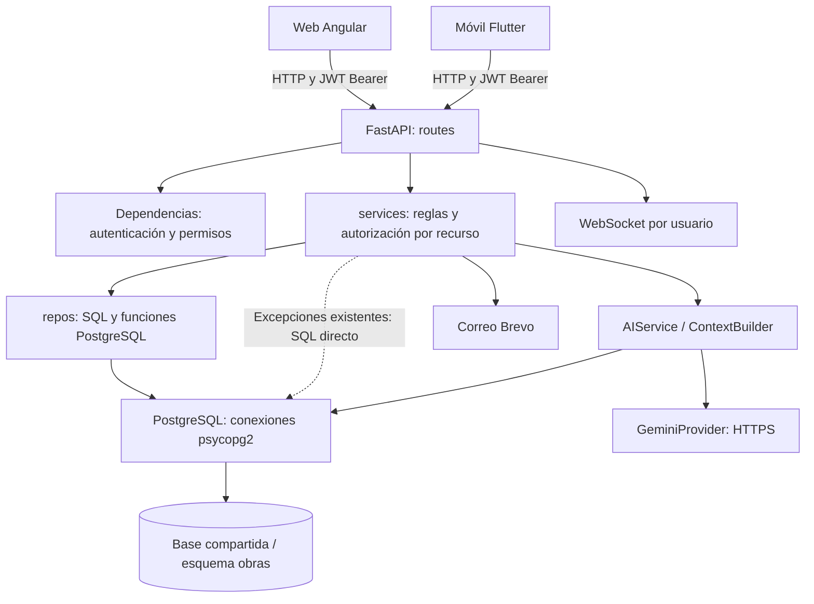

# OBRATEC: arquitectura, patrones y contexto de cambios

Fecha de análisis: 2026-10-04 (America/La_Paz).

Evolución posterior de Backup: [copias base con evidencias ausentes](decisiones/2026-10-04-backup-base-evidencias-ausentes.md), autorizadas por el usuario. El manifiesto y la etapa pública explicitan la omisión; la copia completa sigue estricta y no se certifica recuperación completa de archivos ausentes. Se preservan datos de negocio, esquema, capas y alcance global.

Verificación posterior de Backup/Restore habilitado: [prueba del entorno Ubuntu](PRUEBA_BACKUPS_UBUNTU_2026-10-04.md). El control ya existe y se confirmó conexión real; se corrigió normalización de evidencias Windows sin cambiar capas/permisos ni filas de negocio. Creación bloqueada por archivos ausentes; calendario y restauración pendientes. La observación de migración no aplicada de la entrega inicial siguiente es histórica.

Evolución Backup/Restore: [arquitectura](ARQUITECTURA_BACKUP_RESTORE.md). El módulo global reemplaza SQL parcial en memoria y programación simulada por cola, control PostgreSQL independiente, snapshots cifrados, staging y diario de promoción/compensación. Mantenimiento y session_epoch usan ese control al activarlo; consultar [operación](OPERACION_BACKUPS.md) antes de modificar autenticación, writers, evidencias o despliegue. Migración preparada, no aplicada al servidor actual.

Evolución posterior: [Reportes personalizables y asistente unificado](decisiones/2026-10-04-reportes-personalizables-asistente-unificado.md). Presentación tipada, filtros temporales según fuente y coordinación de consultas Reportes/CRM desde una sola entrada. El tema solo filtra el historial visible. El saldo comercial cruza ventas pactadas y costos autorizados; no acredita cobros. Consultar la arquitectura del módulo antes de modificar estos contratos.

Evolución frontend web: Reportes se organiza en preparación, historial y programaciones; el shell autenticado compone un asistente flotante único, con coordinación mediante signals y protección de respuestas por contexto de empresa. CRM reutiliza esa instancia. Antes de cambiar estos flujos consultar [arquitectura del módulo](ARQUITECTURA_REPORTES_IA.md) y [decisión web](decisiones/2026-10-04-frontend-reportes-chatbot.md). No se modificó backend, móvil ni esquema en esa intervención web.

Actualización del código tras el análisis inicial: [arquitectura de Reportes, IA y automatización](ARQUITECTURA_REPORTES_IA.md). Se agregó catálogo determinista, contexto autorizado, exportadores, proveedores DeepSeek/Gemini, voz y worker persistente. Para estos flujos prevalece esa descripción implementada sobre las observaciones históricas de Gemini exclusivo o ausencia de scheduler en las secciones siguientes. [Operación y activación](OPERACION_REPORTES.md).

## 1. Propósito y alcance

Este documento es la referencia que se debe leer **antes de cada modificación** del proyecto. Todo análisis posterior de arquitectura o patrones debe quedar en un archivo `.md`: actualizar esta referencia cuando cambie la arquitectura y registrar decisiones específicas en `docs/decisiones/` cuando corresponda.

La revisión posterior de la base real está en [ARQUITECTURA_BASE_DATOS.md](ARQUITECTURA_BASE_DATOS.md), con inventarios de tablas, roles, permisos, funciones y procedimientos. Esa revisión confirma RLS desactivado y precisa diferencias de modelo y permisos que el análisis inicial de código solo podía señalar como pendientes de verificar. Consultarla para cambios de persistencia o seguridad.

El análisis se basa en código, configuración declarativa, migraciones SQL y pruebas del repositorio. No se consultó la base de datos desplegada, no se ejecutaron migraciones, no se invocaron servicios externos ni se verificó el despliegue. Las migraciones disponibles describen cambios posibles; su presencia no demuestra que estén aplicadas. Las pruebas mencionadas fueron inspeccionadas, no ejecutadas durante este análisis documental.

## 2. Clasificación arquitectónica

OBRATEC es un sistema de gestión de obras civiles y proyectos inmobiliarios con arquitectura de **monolito organizado por módulos funcionales y tres capas en el backend**, consumido por dos clientes independientes. El aislamiento multiempresa utiliza una base de datos y un esquema compartidos, con discriminación por `id_empresa` y validaciones de pertenencia.

La organización modular se observa en archivos por dominio; existen dependencias cruzadas y accesos SQL desde servicios. No constituye una separación estricta de dominios mediante interfaces. No se observó una arquitectura de microservicios, hexagonal o Clean Architecture formal. La naturaleza SaaS está representada por el acceso compartido multiempresa; no se identificaron módulos de planes, suscripciones comerciales, cobro recurrente o cuotas por tenant en el código revisado.

### Estructura y responsabilidades

| Ubicación | Responsabilidad observada | Referencias |
| --- | --- | --- |
| `backend/run.py`, `backend/app/__init__.py` | Arranque Uvicorn, fábrica de aplicación, CORS y registro de routers | `create_app()` |
| `backend/app/routes/` | Contrato HTTP, dependencias de seguridad, entrada y traducción de errores | `obra_routes.py`, `incidencia_routes.py`, `ai_routes.py` |
| `backend/app/services/` | Casos de uso, validaciones, pertenencia, estados y auditoría | `obra_services.py`, `crm_services.py`, `control_costos_services.py` |
| `backend/app/repos/` | Persistencia, SQL parametrizado, ejecución de funciones y mapeo de resultados | `obra_repos.py`, `estimacion_repos.py`, `incidencia_repos.py` |
| `backend/app/classes/` | Infraestructura de conexiones y conexiones WebSocket | `postgres.py`, `websocket_manager.py` |
| `backend/app/utils/security.py` | JWT, roles y permisos | `verificar_token`, `exigir_rol`, `exigir_permiso` |
| `backend/database/` | Migraciones, funciones, triggers, restricciones y semillas | Archivos `migration_*.sql` |
| `frontend/src/app/` | Páginas Angular, servicios HTTP, guards, interceptores y layout | `app.routes.ts`, `app.config.ts` |
| `mobile/lib/` | Pantallas Flutter, servicios Dio, estado y almacenamiento de sesión | `main.dart`, `services/auth_provider.dart` |

## 3. Patrones realmente presentes

| Patrón o mecanismo | Evidencia | Implicación para modificaciones |
| --- | --- | --- |
| Arquitectura por capas | `routes → services → repos` | Mantener reglas en servicios y persistencia en repositorios; revisar excepciones locales antes de tocar un módulo. |
| Service Layer | Funciones de casos de uso en `*_services.py` | Reutilizar el caso de uso para ambos clientes y evitar reglas exclusivas de la interfaz. |
| Repository / DAO funcional | Módulos `*_repos.py` con SQL y mapeo | Es una abstracción pragmática de acceso a datos; no hay interfaces de repositorio ni agregados de dominio formales. |
| Application Factory | `create_app()` | Registrar routers y configuración de aplicación en el punto de composición existente. |
| Inyección de dependencias | FastAPI `Depends`, Angular `inject`/providers y `AIService(provider=None)` | Sustituir dependencias en pruebas y reutilizar mecanismos existentes. Muchos repositorios crean su conexión directamente. |
| Adaptador de proveedor | `GeminiProvider.generar_respuesta()` | Encapsular transporte y errores de IA; la sustitución es posible por compatibilidad de métodos, sin interfaz formal ni registro de estrategias. |
| Instancias compartidas por proceso | `ai_service`, `manager`, pool y caché de permisos | No asumir estado compartido entre workers o servidores. |
| Observer / estado reactivo | `BehaviorSubject` en Angular, `ChangeNotifier` con Provider en Flutter | Propagar cambio de sesión/empresa por los mecanismos existentes. |
| Máquina de estados explícita | `TRANSICIONES` en incidencias | Validar transición y actor autorizado; no equivale a un patrón State con clases por estado. |
| Jerarquía por lista de adyacencia | `id_padre` y `construir_arbol_jerarquico()` | Preservar pertenencia al proyecto y restricciones de nodos; no hay Composite formal con objetos polimórficos. |
| Reglas también en PostgreSQL | Funciones `sp_*`/`fn_*`, triggers, `CHECK`, `UNIQUE` y FK | Leer el SQL relevante junto al Python: la lógica no reside exclusivamente en el backend. |

No se identificó una Unit of Work general. El wrapper permite conexiones compartidas mediante argumentos `db`, pero varias operaciones y registros de bitácora realizan commits o usan conexiones separadas.

## 4. Modelo SaaS y aislamiento de tenants

### Identidad y seguridad

- Tenant: empresa en `obras.t_empresa`, identificada por `id_empresa`.
- Usuario: `t_usuario`, relacionado con persona, rol y empresa. El registro y el login reflejan una empresa en la sesión; no se observó un contexto de membresías múltiples por usuario en ese flujo.
- JWT: incluye `nro_usuario`, `nombre_rol`, `id_empresa`, nombres, `iat` y `exp`. Se firma con HS256; la duración predeterminada es 120 minutos (`utils/security.py`).
- Autenticación: `HTTPBearer` y `verificar_token` validan el token. No realizan por sí mismos una nueva validación de estado del usuario o pertenencia en cada solicitud.
- Autorización: `exigir_permiso` consulta `t_rol`, `t_rol_permiso` y `t_permiso`, con caché de 120 segundos por proceso y nombre de rol. `exigir_rol` aplica listas explícitas.
- `ADMINISTRADOR` es administrador global; `ADMINISTRADOR_EMPRESA` conserva ámbito de tenant. `es_admin_sistema()` decide por rol, no por nombre de empresa. `test_security_rules.py` documenta esa distinción.
- Empresa seleccionada en los clientes: estado de navegación y filtros. No cambia automáticamente el JWT ni concede acceso a otra empresa.

No se encontraron políticas RLS (`ROW LEVEL SECURITY`/`CREATE POLICY`) en las migraciones revisadas. Por tanto, el aislamiento observado depende de validaciones Python, filtros SQL y funciones de base de datos. No se puede afirmar el estado de RLS de una base desplegada sin inspeccionarla.

### Resolución de empresa: diferencias actuales

| Módulo | Comportamiento observado | Atención requerida |
| --- | --- | --- |
| Empresas | Rutas restringidas a `ADMINISTRADOR` | CRUD de tenants es administración de plataforma. |
| Obras | Empresa del JWT para usuario normal; administrador puede indicar empresa al crear y obtener ámbito global en otras operaciones | Revisar cada operación y función SQL; no extrapolar una regla a todo el módulo. |
| Estructura | Usa `None` para administrador y empresa del JWT para otros roles | `None` actúa como ausencia de filtro en operaciones que lo soportan. |
| CRM e IA CRM | `_empresa()` rechaza empresa distinta para usuario normal; administrador puede solicitar empresa, y algunos listados permiten `None` | En operaciones obligatorias sin selección el administrador puede caer en empresa del JWT o **ID 1**. |
| Incidencias | `_empresa_id()` toma el JWT y devuelve `None` para administrador | La pertenencia de obra, responsable, unidad y OT se valida por recurso; no deducir permisos de escritura solo por acceso global. |
| Estimaciones y control de costos | `_empresa()` exige `id_empresa` del JWT | La empresa seleccionada en UI no sustituye ese valor. Los handlers revisados pasan el token al servicio. |
| Presupuestos/APU anterior | Validaciones propias y excepción para administrador | Algunas comprobaciones dependen de que `token_empresa` tenga valor; revisar tokens incompletos y el estado del modelo antiguo. |

### Reglas a preservar o comprobar antes de cambiar

Estas son condiciones de revisión, no una certificación de que todos los endpoints ya las cumplen:

1. Obtener el ámbito autorizado del JWT validado; tratar una empresa solicitada como un dato que debe autorizarse.
2. Exigir permiso de acción y pertenencia del recurso. Un permiso de lectura no prueba pertenencia ni autoriza modificación.
3. Verificar relaciones completas: empresa → obra → estructura/unidad/OT, y empresa de material/proveedor/usuario/cliente.
4. Evitar asociaciones entre tenants incluso para operaciones de administrador cuando la relación de negocio exige una misma empresa.
5. Rechazar contexto de empresa ausente para usuarios normales; no convertirlo silenciosamente en acceso global.
6. Revisar detalle, listado, modificación, eliminación, archivos, métricas y exportaciones: proteger solo listados deja acceso directo por identificador.
7. Mantener globalidad como excepción explícita. Un backup de esquema es una operación global y no una exportación de un tenant.

## 5. Dominios y relaciones funcionales

| Dominio | Responsabilidad y relaciones | Archivos principales |
| --- | --- | --- |
| Identidad y plataforma | Registro, sesión, recuperación, perfil, usuarios, roles, empresas y bitácora | `auth_*`, `users_*`, `roles_*`, `tenant_*`, `password_recovery_*`, `bitacora_*` |
| Proyectos/obras | Datos generales, estado, supervisor, cliente, ubicación y asignación de personal | `obra_*`, `migration_personal_obra.sql` |
| Estructura y unidades | Árbol de obra, unidades de construcción, modelos, ambientes y características | `estructura_*`, `unidad_*`, migraciones CU12 |
| Recursos y abastecimiento | Materiales, proveedores, equipos, compras, recepción, inventario y movimientos | `material_*`, `proveedor_*`, `compras_*`, `inventario_*`, `equipos_maquinaria_*` |
| Estimaciones/APU | Análisis de precio unitario, insumos, jerarquía, estimaciones, aprobación y versiones | `estimacion_*`, `migration_estimacion_apu.sql`, `migration_cu16_refactor_apu_presupuesto.sql` |
| Control de costos | Línea base desde estimación aprobada, costos ejecutados y órdenes de cambio | `control_costos_*`, migración CU17 |
| Operación de obra | Órdenes de trabajo, responsables, incidencias, seguimiento y evidencias | `orden_Trabajo_*`, `incidencia_*`, migraciones CU19 |
| CRM | Prospectos/clientes comerciales, etapas, interacciones y asociación a unidades | `crm_*`, migración CU21 |
| Integraciones | IA CRM, correo, notificaciones WebSocket y backup | `services/ai/`, `email_service.py`, `notificaciones_*`, `backup_*` |

El término proyecto en UI/API corresponde principalmente a `t_obra` y módulos `obra_*`. Los clientes del CRM (`t_crm_cliente`) son registros comerciales vinculados a personas; no se deben equiparar automáticamente con cuentas autenticadas del rol `CLIENTE`.

Relaciones centrales observadas: empresa → obras → estructura jerárquica → unidad de construcción; obra → personal/OT/incidencias; empresa → materiales/proveedores; empresa → CRM → interacciones/asociaciones a unidades; obra → estimaciones → línea base/control de costos.

### Estados y valores derivados

Incidencias define `ABIERTA → ASIGNADA → EN_PROCESO → PENDIENTE_VALIDACION → RESUELTA → CERRADA`; permite retornar de `PENDIENTE_VALIDACION` a `EN_PROCESO`. Hay controles específicos de responsable, permisos, asignación a obra y validación.

La afectación de una OT por incidencia es **derivada en lectura** mediante `AFECTADA_POR_INCIDENCIA_SQL` (`repos/orden_trabajo_afectacion.py`). Usa `EXISTS`, exige la misma obra y considera incidencias `ABIERTA`, `ASIGNADA`, `EN_PROCESO` o `PENDIENTE_VALIDACION`. No debe sustituirse por cambios al estado operativo de la OT ni a sus responsables. Las pruebas `test_ot_afectacion.py` cubren múltiples vínculos, aislamiento y concurrencia.

Control de costos usa `Decimal` con escalas explícitas. Preservar precisión, snapshots, línea base y trazabilidad al modificar cálculos; no introducir `float` en ese flujo por analogía con módulos anteriores.

## 6. Persistencia, transacciones y evolución SQL

La persistencia revisada usa `psycopg2` y SQL explícito. Aunque `sqlalchemy` está en `requirements.txt`, no se observó su uso en `backend/app`.

`PostgreSQL` crea de forma diferida un `ThreadedConnectionPool` de 2 a 20 conexiones **por proceso**, verifica conexiones y tiene fallback a conexión directa. `execute_query()` admite commit y hace rollback al fallar; `close_connection()` revierte lo pendiente por defecto y devuelve la conexión al pool. No se debe suponer que cerrar confirma escrituras.

Conviven SQL directo y funciones PostgreSQL: autenticación usa `sp_login_usuario`; obras usa funciones almacenadas; estimaciones combina SQL y funciones de cálculo. Para cambios de reglas es necesario revisar tanto el servicio/repositorio como la función SQL.

Las migraciones son scripts independientes. `backend/run_migration.py` apunta específicamente a `migration_cu15_proveedores.sql`; no es un gestor de toda la secuencia ni acredita un historial aplicado. No se identificó configuración Alembic en la estructura revisada.

### Coexistencia de modelos de costos: punto crítico

- La migración CU16 original crea `t_presupuesto`, `t_apu`, `t_apu_componente` y `t_partida_presupuesto`.
- El flujo de `estimacion_repos.py` utiliza `t_analisis_precio_unitario`, `t_analisi_precio_unitario_insumo` y `t_estimacion`. El nombre `analisi` es el identificador SQL existente, no un error a corregir sin migración.
- `migration_retirar_apu_legacy.sql` archiva datos y retira tablas/funciones antiguas de APU, mientras `presupuesto_routes.py` sigue registrado y `presupuesto_services.py` conserva operaciones del modelo anterior.
- El control de costos actual referencia estimaciones aprobadas (`id_estimacion_base`).

Antes de modificar presupuestos/APU: rastrear el servicio que consume la pantalla concreta, comprobar qué modelo usa su endpoint y validar el esquema real y las migraciones aplicadas. No asumir que todas las rutas registradas son compatibles con cualquier orden de migración. No ejecutar scripts antiguos para reconstruir tablas retiradas sin una decisión documentada.

## 7. Clientes web y móvil

### Web

El manifiesto declara Angular 21.2, TypeScript, RxJS, Tailwind, Leaflet y XLSX. `app.config.ts` configura router, HttpClient con interceptores, fetch e hidratación; hay archivos SSR y servidor Express. Esto acredita soporte de SSR en el repositorio, no el modo de despliegue real.

La organización es por páginas y servicios HTTP. `AuthService` almacena token/usuario en `localStorage`, mantiene empresa seleccionada con `BehaviorSubject` y resuelve empresa activa. `authGuard`, `publicGuard` y `roleGuard` controlan navegación; `roleGuard` usa permisos y compatibilidad con roles. `authInterceptor` añade Bearer. Los guards son controles de UI, y el backend es la autoridad.

Los permisos web pueden venir del usuario de sesión o de mapas locales por rol. Esa representación puede divergir de la base de datos, donde el backend consulta permisos. Revisar ambos lados al cambiar permisos, sin asumir que un botón visible garantiza autorización.

### Móvil

Flutter/Dart organiza `screens`, `services`, `widgets` y `theme`. `MultiProvider` proporciona `AuthProvider` y `ThemeProvider`; `ChangeNotifier` notifica cambios. `ApiClient` comparte Dio, incorpora token, permite URL personalizada y elimina el token al recibir 401. `TokenStorage` usa `flutter_secure_storage`.

`AuthProvider` mantiene empresa activa y mapas locales de permisos. En la restauración revisada considera autenticada una sesión con token presente; no comprueba ahí su expiración. Cambiar permisos o sesiones requiere revisar también este cliente, y no solo Angular.

Los entornos web apuntan a backend local o Render; móvil permite `API_BASE_URL` y configuración personalizada. Las URL declaradas no prueban disponibilidad del servicio.

## 8. Flujo de IA CRM y límites

El archivo activo `backend/app/routes/ai_routes.py` expone consulta y sugerencias. La consulta sigue:

1. `POST /api/ai/crm/consulta`: exige `Visualizar_clientes`, recibe pregunta y empresa opcional.
2. `AIService.consultar_crm()`: valida pregunta y resuelve tenant con `crm_services._empresa()`.
3. `ContextBuilder`: obtiene nombre de empresa, métricas, hasta 10 prospectos destacados, 5 interacciones y 10 asociaciones recientes a unidades.
4. `GeminiProvider`: serializa contexto, llama HTTPS con timeout y reintentos limitados, y transforma errores del proveedor.
5. Auditoría `CONSULTA_IA_CRM`: registra empresa de la consulta sin guardar el prompt completo; devuelve respuesta y métricas.

Es una consulta asistida con contexto construido desde SQL. No se identificaron búsqueda vectorial, agentes con herramientas ni ejecución de SQL generado por el modelo.

El contexto está acotado por tenant y cantidad de registros, pero contiene nombres, presupuestos y texto de interacciones. No es anónimo. Las instrucciones del prompt no sustituyen el aislamiento SQL ni garantizan exactitud. Antes de ampliar el contexto, comprobar filtros y relaciones de empresa, pertinencia de datos y límites de exposición. No atribuir al asistente conocimiento de filas excluidas por los límites.

La integración utiliza el helper privado `_empresa` de CRM y el constructor de contexto hace SQL directo. Son dependencias reales a tener en cuenta si se refactoriza CRM o la capa de persistencia.

## 9. Hallazgos que condicionan cambios posteriores

| Hallazgo verificado en código | Consecuencia | Acción cuando el cambio afecte esa zona |
| --- | --- | --- |
| Resolución de empresa distribuida y desigual | Selección global de UI no tiene el mismo efecto en todos los módulos | Definir y verificar el comportamiento de la operación concreta antes de unificar helpers. |
| Fallback CRM a empresa 1 y presupuesto a usuario 1 | Contexto implícito ante identidad incompleta | Revisar explícitamente los casos faltantes; evitar extender esos fallbacks. |
| Comparaciones de presupuesto condicionadas a `token_empresa` existente | Una comprobación puede omitirse si falta empresa en un JWT válido | Añadir pruebas de contexto incompleto al intervenir ese módulo. |
| Login admite comparación de contraseña en texto plano como fallback | Compatibilidad heredada con credenciales sin hash | Evaluar migración de credenciales cuando se trabaje autenticación. |
| Configuración tiene claves JWT/secret predeterminadas en código | El despliegue depende de sustituirlas correctamente | Verificar configuración del entorno al trabajar seguridad; no copiar valores al documento. |
| Registro público puede buscar empresa por nombre y usar `nro_rol` en determinadas ramas | Nombre de empresa no constituye una invitación o prueba de pertenencia | Revisar alta, aprobación y asignación de rol antes de modificar onboarding. |
| Permisos almacenados en BD y mapas en dos clientes | Riesgo de desalineación de acciones visibles | Revisar rutas, permisos backend, Angular y Flutter juntos. |
| Cachés, pool y WebSocket en memoria | Estado independiente por worker; manager guarda un socket por usuario | Revisar escalado, múltiples dispositivos y reconexión cuando se modifiquen notificaciones. |
| Routers CRM, IA e inventario registrados con prefijos dobles | Existen rutas `/api/...` y aliases sin `/api` | Identificar consumidores antes de retirar aliases. |
| Servicios con SQL directo y bitácora en operaciones separadas | Capas permeables y atomicidad variable | Determinar límites de transacción; no asumir rollback global. |
| Evidencias de incidencias guardadas en filesystem | Persistencia de archivos requiere tratamiento propio | Revisar autorización de descarga, rutas y durabilidad del almacenamiento al modificar evidencias. |
| Referencias heredadas a talleres/emergencias en móvil y notificaciones | Terminología y código del sistema anterior siguen presentes | Rastrear uso real antes de eliminar o renombrar. |

Estos hallazgos describen implementación y riesgos concretos. No implican que se haya demostrado explotación, ni que se hayan comprobado todas las rutas o la configuración productiva.

## 10. Procedimiento obligatorio para cada modificación

1. Leer este documento, `AGENTS.md` y las instrucciones locales aplicables. Todo razonamiento de arquitectura/patrones debe persistirse en `.md`.
2. Revisar el estado de Git y localizar el flujo real: pantalla → servicio cliente → ruta → servicio backend → repositorio → SQL. Leer archivos actuales: este documento es un mapa, no reemplaza el código.
3. Identificar el caso de uso, los contratos existentes y dependencias entre módulos. Determinar si afecta Angular, Flutter, aliases de API, datos o funciones almacenadas.
4. Antes de editar, registrar en Markdown un análisis proporcional: petición, comportamiento actual, capas y patrones implicados, ámbito de tenant/roles, cambio previsto, validación y dudas relevantes. Para un cambio pequeño basta una nota breve en `docs/decisiones/`.
5. Implementar el cambio mínimo coherente con el patrón existente. Introducir una reorganización arquitectónica solo si resuelve una necesidad del pedido y queda explicada. No mover reglas a la UI ni mezclar SQL nuevo en rutas.
6. Verificar tenant normal, otra empresa, contexto incompleto y administrador cuando sean relevantes. Revisar permisos, relaciones, estados, dinero, transacciones y bitácora según el caso.
7. Ejecutar comprobaciones proporcionales y reportar resultados reales. Separar pruebas aisladas de integraciones que necesiten BD, red o secretos. No ejecutar pruebas funcionales que escriban en una BD desconocida sin revisar su comportamiento.
8. Actualizar este documento si cambia arquitectura, patrones, aislamiento, contratos estructurales o modelo persistente; actualizar la nota del cambio con implementación final y validación.

### Formato de nota de cambio

Crear `docs/decisiones/AAAA-MM-DD-descripcion.md` cuando proceda, con estas secciones:

- Solicitud y alcance.
- Contexto actual y archivos revisados.
- Patrones, capas y tenants afectados.
- Decisión y efectos sobre contratos/datos.
- Implementación final y validación realizada.
- Limitaciones o trabajo pendiente, si existe.

Una fecha o documento de análisis no otorga autorización para desplegar, ejecutar migraciones o alterar datos productivos. Documentar recomendaciones no significa implementarlas automáticamente.

## 11. Mapa de validación disponible

- Backend: `backend/tests/` incluye seguridad, materiales, proveedores, personal de obra, incidencias, autorización y costos. Hay pruebas `unittest` y `pytest`, con dobles de DB en varios módulos y archivos de verificación que pueden necesitar BD real. Revisar antes de ejecutar.
- Incidencias/OT: `test_incidencia_authorization.py`, `test_incidencia_services.py`, `test_incidencia_atencion.py`, `test_incidencia_registro_movil.py`, `test_ot_afectacion.py`.
- Costos y recursos: `test_control_costos_services.py`, `test_material_services.py`, `test_proveedor_services.py`, `test_obra_personal.py`.
- Web: manifiesto con `npm test` y `npm run build`; specs y configuraciones TypeScript particulares para OT, personal y CU19.
- Móvil: `mobile/test/`, incluido `incidencia_test.dart`; revisar `flutter analyze`/`flutter test` según el cambio.

Para esta revisión se validó la correspondencia documental con los archivos citados. No se realizaron cambios de código, pruebas de ejecución ni comprobaciones de aislamiento contra una base real.
