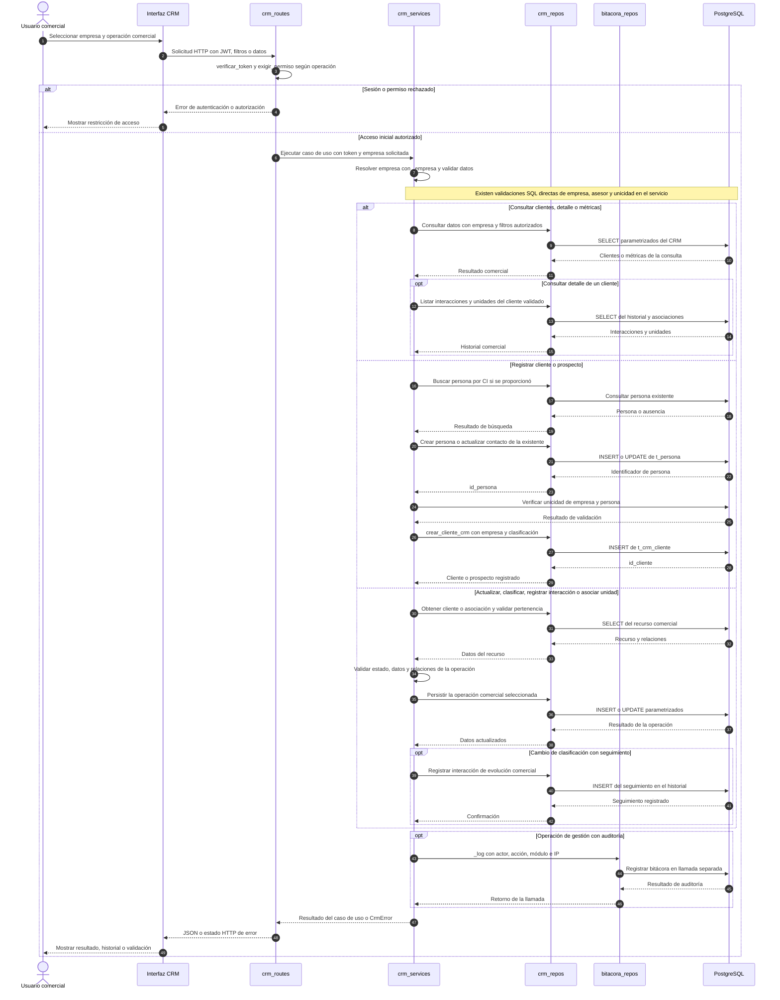
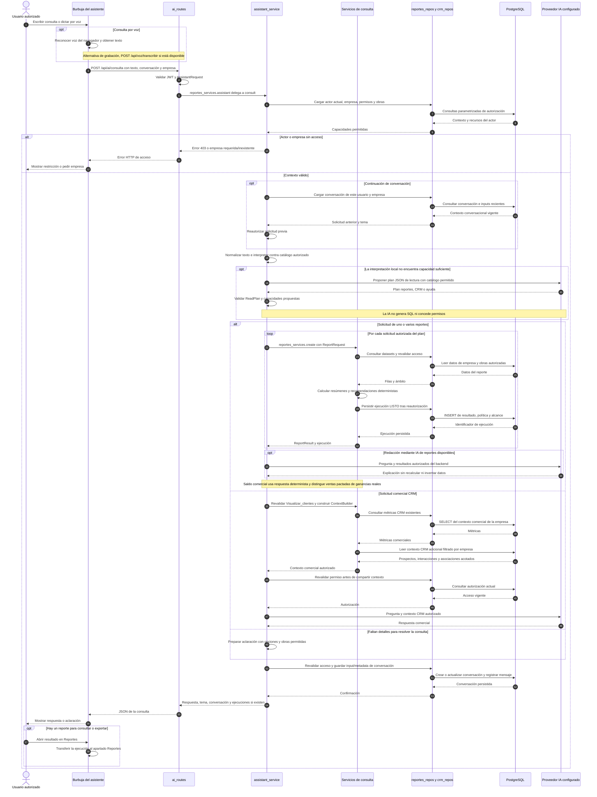
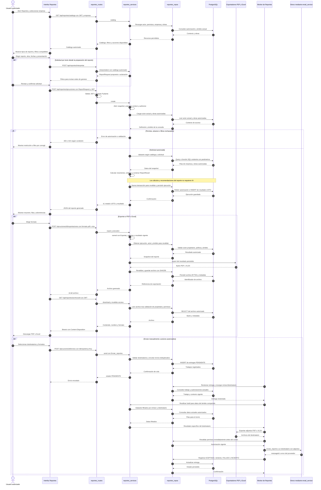

# Diagramas de secuencia: CU25, CU26 y CU27

Fecha: 2026-10-04 (America/La_Paz). Diagramas Mermaid basados en el código actual de OBRATEC. Representan el flujo web implementado y sus servicios backend compartidos; no se realizaron cambios de código ni operaciones sobre la base.

Los bloques `alt` representan alternativas y los bloques `opt` operaciones opcionales. Las consultas y escrituras a PostgreSQL se muestran por responsabilidad, agrupando llamadas repetidas para mantener legibilidad. Cada solicitud HTTP incluye su JWT, aunque se omita repetirlo en las extensiones del flujo.

Referencias de arquitectura: [general y patrones](ARQUITECTURA_Y_PATRONES.md), [Reportes e IA](ARQUITECTURA_REPORTES_IA.md) y [operación de Reportes](OPERACION_REPORTES.md).

## Imágenes exportadas

| Caso de uso | PNG | SVG ampliable |
| --- | --- | --- |
| CU25 – Gestionar Clientes y CRM | [Abrir imagen](diagramas/secuencia/CU25.png) | [Abrir vector](diagramas/secuencia/CU25.svg) |
| CU26 – Consultar Asistente Inteligente (I1) | [Abrir imagen](diagramas/secuencia/CU26.png) | [Abrir vector](diagramas/secuencia/CU26.svg) |
| CU27 – Generar Reportes | [Abrir imagen](diagramas/secuencia/CU27.png) | [Abrir vector](diagramas/secuencia/CU27.svg) |

Se exportaron las secuencias completas con el parser/renderizador real de Mermaid. [Índice de imágenes](diagramas/secuencia/README.md). [Decisión y validación de las imágenes](decisiones/2026-10-04-imagenes-secuencias-cu25-cu27.md).

## 1. CU25 – Gestionar Clientes y CRM

**Actor:** usuario con permisos comerciales, por ejemplo administrador de empresa o administrador global. **Precondición:** sesión válida y acceso a la empresa/recurso de la operación. **Resultado:** clientes, prospectos, interacciones o asociaciones consultados/actualizados, con auditoría de las acciones de gestión.

**Contratos y límites del flujo:**

| Operación | Ruta principal | Permiso |
| --- | --- | --- |
| Listar y consultar detalle | `GET /api/crm/clientes`, `GET /api/crm/clientes/{id_cliente}` | `Visualizar_clientes` |
| Consultar métricas | `GET /api/crm/clientes/metricas` | `Visualizar_clientes` |
| Registrar | `POST /api/crm/clientes` | `Registrar_clientes` |
| Actualizar y clasificar | `PUT /api/crm/clientes/{id_cliente}`, `PATCH /api/crm/clientes/{id_cliente}/clasificacion` | `Modificar_clientes` |
| Registrar interacción | `POST /api/crm/clientes/{id_cliente}/interacciones` | `Modificar_clientes` |
| Asociar unidad y cambiar su estado | `POST /api/crm/clientes/{id_cliente}/unidades`, `PATCH /api/crm/asociaciones/{id_cliente_unidad}/estado` | `Modificar_clientes` |

Los usuarios de empresa quedan ligados a la empresa del JWT. El CRM actual permite al administrador global consultas sin filtro empresarial cuando no indica empresa; en escrituras conserva un fallback a su empresa o a 1. El diagrama muestra la variante con empresa seleccionada. Esa excepción existente difiere del asistente y Reportes, que requieren empresa explícita para el administrador global.

El registro de persona puede preceder a la validación de duplicidad comercial. Las operaciones de CRM y bitácora no forman una transacción única: `_log` tolera fallos de auditoría. Un `CrmError` interrumpe el flujo restante y se traduce en su estado HTTP; el diagrama no presupone rollback de todas las operaciones anteriores. No se dibuja eliminación de clientes porque estas rutas no la implementan.

Fuentes: [rutas](../backend/app/routes/crm_routes.py), [servicios](../backend/app/services/crm_services.py), [repositorio CRM](../backend/app/repos/crm_repos.py) y [bitácora](../backend/app/repos/bitacora_repos.py).

## 2. CU26 – Consultar Asistente Inteligente (I1)

**Actor:** usuario autenticado con acceso a consultas de Reportes o CRM. **Precondición:** contexto empresarial válido y capacidades autorizadas. **Resultado:** respuesta en lenguaje natural, reporte reutilizable cuando corresponde, o solicitud concreta de aclaración. La burbuja es única; el tema permite filtrar el historial visible.

El proveedor se selecciona mediante `get_provider()` y adaptadores DeepSeek/Gemini; el diagrama no fija el modelo ni expone configuración secreta. Si falla el proveedor, el coordinador conserva la interpretación local o devuelve el resumen determinista disponible. Una aclaración puede pedir obra, fechas o precisión; no ejecuta escrituras comerciales.

En la rama Reportes se reutiliza CU27: no son queries creadas por el modelo. En la rama CRM, `ContextBuilder` combina el repositorio existente con SQL parametrizado propio ya implementado. Durante solicitudes al proveedor no se mantiene abierta la transacción del coordinador único. El historial persiste texto solicitado y metadata/referencias; no guarda las filas ni la respuesta completa del modelo en los mensajes.

Una conversación ajena o vencida termina con error; una capacidad no permitida se rechaza aunque la proponga la IA. `ADMINISTRADOR` requiere empresa explícita; los demás actores quedan en su empresa actual y obras permitidas. La etiqueta **I1** se conserva como parte del nombre del caso de uso solicitado.

La ruta antigua `/api/ai/crm/consulta` sigue disponible, pero la burbuja actual utiliza `/api/ai/consulta`; el diagrama representa esta entrada unificada.

Fuentes: [burbuja web](../frontend/src/app/components/asistente/asistente.ts), [contrato HTTP web](../frontend/src/app/services/reportes.service.ts), [rutas IA](../backend/app/routes/ai_routes.py), [coordinador único](../backend/app/services/ai/assistant_service.py), [contexto CRM](../backend/app/services/ai/context_builder.py), [autorización](../backend/app/services/reportes/authorization.py) y [adaptadores](../backend/app/services/ai/providers.py).

## 3. CU27 – Generar Reportes

**Actor:** usuario con permiso de consulta del reporte y su dominio. **Precondición:** sesión válida, empresa autorizada, filtros compatibles y obras dentro del alcance. **Resultado principal:** ejecución `LISTO` con resultado determinista, corte, ámbito y advertencias. **Extensiones:** exportar PDF/Excel, enviar o programar con sus permisos adicionales. Las rutas abreviadas de las extensiones usan el prefijo `/api/reportes`.

La generación manual es síncrona: retorna `LISTO` cuando terminó lectura, cálculo y persistencia. Se separan el snapshot de lectura y la transacción de persistencia, con reautorización entre ambos. El permiso base actual es `Visualizar_reportes` junto al permiso del dominio; no se inventa un permiso `Generar_reportes` que el flujo no usa. Rango de fechas solo cuando la definición del catálogo lo admite.

La exportación reutiliza el resultado persistido. El envío vuelve a consultar datos y prepara un resultado para cada destinatario según la intersección de permisos, obras y filas; por eso su corte puede diferir del reporte visto inicialmente. `ACEPTADO` significa que Brevo aceptó el envío, no que el actor haya recibido o leído el correo. Una respuesta incierta no se trata como éxito ni se reenvía indiscriminadamente.

**Extensión programada:** `POST /api/reportes/programaciones` guarda solicitud, destinatarios, formatos, frecuencia, zona y próximo vencimiento, tras validar `Programar_reportes`, `Enviar_reportes` y los permisos de las fuentes. El worker consulta programaciones vencidas, crea una ejecución `PENDIENTE`, genera mediante `build` y continúa con la misma rama de entrega del diagrama. Guardar una programación no arranca el worker. El proceso requiere configuración operativa y participa en la barrera de Backup/Restore; no genera ni envía durante mantenimiento.

**Otras salidas:** resultado demasiado grande o exportación superior a 5 MiB requiere acotar filtros; permisos revocados invalidan consulta, descarga o envío; tablas propias de Reportes ausentes producen `503 REPORTES_SCHEMA_MISSING`. Estas condiciones interrumpen la extensión correspondiente y no conceden acceso a otro tenant.

Fuentes: [pantalla web](../frontend/src/app/pages/reportes/reportes.ts), [rutas](../backend/app/routes/reportes_routes.py), [servicios](../backend/app/services/reportes_services.py), [repositorio](../backend/app/repos/reportes_repos.py), [catálogo](../backend/app/services/reportes/catalog.py), [autorización](../backend/app/services/reportes/authorization.py), [exportadores](../backend/app/services/reportes/exporters.py), [worker](../backend/app/services/reportes/worker.py), [calendario](../backend/app/services/reportes/scheduling.py) y [correo](../backend/app/services/email_service.py).

## Alcance del análisis y validación

Se revisaron instrucciones del proyecto, referencias arquitectónicas y código actual de rutas, servicios, repositorios, contexto, proveedores, exportación, worker y clientes web. Los diagramas describen capas existentes, adaptadores de IA/exportación, contexto autorizado por tenant, persistencia de conversaciones y cola de entregas. No sustituyen contratos de aceptación ni demuestran activación operativa de proveedor, voz o correos.

Se comprobaron enlaces locales y estructura de los tres bloques Mermaid. No se consultó la base real, aplicó migración, inició backend/worker ni se enviaron correos para esta entrega documental.
