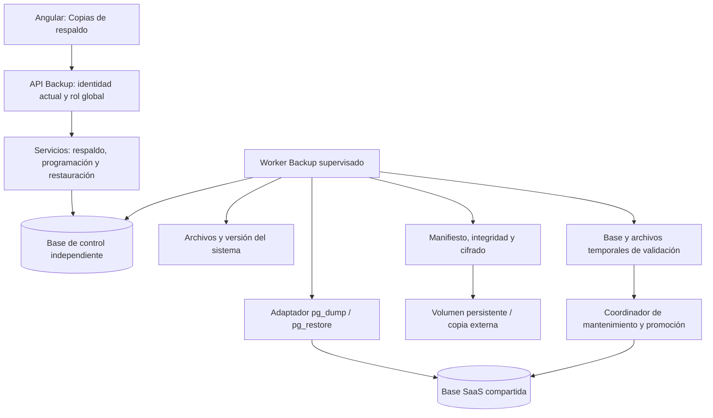

# Plan de implementación: copias de respaldo y restauración OBRATEC

Fecha: 2026-10-04. Estado: **aprobado e implementado en código; activación y ensayo del despliegue pendientes de entorno designado**.

Implementación y límites reales: [arquitectura](ARQUITECTURA_BACKUP_RESTORE.md). Instalación y recuperación: [operación](OPERACION_BACKUPS.md). Migración de control preparada, no aplicada al servidor actual. El diseño aprobado siguiente debe contrastarse con esos documentos al operar.

## 1. Objetivo y contexto revisado

Habilitar `/backup` como centro de recuperación de la plataforma: generar copias manuales, programarlas, consultar historial, descargar paquetes y restaurar datos o el sistema completo con validación previa. Adaptar la interfaz al frontend Angular actual, sus permisos, tema claro/oscuro y funcionamiento sin Zone.js.

Se revisaron `AGENTS.md`, arquitectura general y de PostgreSQL, inventario/rutinas, arquitectura y operación de Reportes, rutas/servicios actuales de backup, evidencias de incidencias, autenticación y el worker de Reportes. Esta revisión fue documental y de código/localización de herramientas; no se conectó a la base, generó un dump, restauró información ni modificó configuración.

| Hallazgo actual | Consecuencia y cambio propuesto |
| --- | --- |
| Existe `GET /api/backup/manual`, registrado en la fábrica FastAPI. | Evolucionar el módulo existente, sin crear otra pantalla de backups. |
| Ejecuta `pg_dump` de `Config.SCHEMA` en SQL plano y captura todo el resultado en memoria. | Dump completo de la base configurada en formato custom, escrito a archivo y procesado como trabajo. |
| Usa nombres y textos de «red de talleres». | Sustituir por OBRATEC, obras y plataforma multiempresa. |
| La programación frontend es un `setTimeout`; no persiste ni ejecuta backups. | Sustituir la simulación por API, programación persistida y worker supervisado. |
| No hay restauración, historial durable ni verificación de copias. | Incorporar catálogo, integridad, validación en base temporal y recuperación controlada. |
| La ruta Angular exige `Visualizar_empresa`; el menú y backend usan ADMINISTRADOR global. | Unificar restricciones de ruta, menú, API y worker. |
| Fotografías están en `backend/uploads/incidencias`, con rutas relativas guardadas en PostgreSQL. | Incluir archivos además del dump para recuperar evidencias. |
| Reportes guarda archivos en BYTEA y contiene colas que pueden enviar por Brevo. | El dump incluye estos datos; la restauración debe impedir reactivar envíos antiguos automáticamente. |
| Los tests de Backup importan `Backup`, pero las clases reales son `BackupComponent` y `BackupService`. | Corregir los tests e incorporar pruebas funcionales del flujo real. |
| No se encontraron `pg_dump`, `pg_restore` o `psql` en PATH ni binarios en las ubicaciones Windows comprobadas. | Instalar/configurar cliente PostgreSQL en el host ejecutor durante la preparación; comprobar versiones. |

La documentación previa identifica PostgreSQL 17.11 y un esquema compartido por tenants, sin RLS. Esa fotografía deberá comprobarse de nuevo antes de implementar migraciones o activar operaciones. Las menciones actuales a EC2 en la pantalla no demuestran que el despliegue sea AWS; el plan no depende de ese proveedor.

## 2. Alcance que tendrá la pantalla

| Modalidad | Contenido | Recuperación que permite |
| --- | --- | --- |
| Base de datos | Todos los esquemas de aplicación de la base configurada, datos, funciones/procedimientos, triggers, índices, restricciones, secuencias, extensiones y objetos grandes aplicables. | Restaurar la base; comprobar aparte las evidencias externas necesarias. |
| Sistema completo — predeterminada | Base de datos + archivos de `uploads` + manifiesto + artefacto de la versión del backend/frontend y archivos de dependencias/migraciones necesarios. | Recuperar datos, evidencias y una versión compatible del software servidor. |

El paquete completo debe registrar la versión efectiva del despliegue y huellas de los artefactos, incluso en desarrollo cuando aún no exista un commit de release. No incluir `.git`, dependencias instaladas, caches, directorios temporales, logs indiscriminados, otros backups ni archivos `.env`. Las claves y credenciales se recuperan desde un almacenamiento de secretos separado; el paquete incluye sus nombres/requisitos, nunca valores.

Los roles funcionales, permisos y usuarios están en las tablas y quedan incluidos. Los roles del motor PostgreSQL y tablespaces son objetos del clúster: documentar su recreación/mapeo y ofrecer al operador un complemento de globals sin contraseñas cuando tenga privilegios. No prometer que un dump de una base contiene la instalación PostgreSQL o todo el servidor. La infraestructura/secretos se reconstruyen mediante el procedimiento operativo. Los móviles vuelven a conectarse al backend restaurado; esta función no reinstala apps ni recupera datos locales de los teléfonos.

Las copias son **globales**: contienen todas las empresas. No habrá descarga o restauración global para ADMINISTRADOR_EMPRESA, jefe, cliente o trabajador. Una futura exportación por tenant será otro caso de uso, con resolución de dependencias y referencias compartidas; no se resolverá filtrando tablas por `id_empresa`.

## 3. Arquitectura y patrones propuestos

Preservar `routes → services → repos`; el servicio coordina adaptadores de PostgreSQL, archivos, cifrado y almacenamiento. Reutilizar el patrón de trabajos persistentes de Reportes y su lógica horaria donde sea independiente; mantener un worker de backups separado, porque generación/restauración y mantenimiento tienen responsabilidades distintas al envío de reportes.

**Decisión de control:** guardar catálogo, horarios, trabajos, bloqueos, auditoría de recuperación y estado de mantenimiento en una base PostgreSQL de control distinta de la base restaurada. No guardar el único historial de restauraciones dentro del dump que lo sobrescribirá. Configuración de conexión independiente, sin FK entre bases: la referencia al actor será auditada, pero la autorización se recargará desde cuentas actuales. Los manifiestos externos permitirán reconstruir el catálogo si se pierde la base de control; también se documentará el respaldo independiente de esa base.

Patrones: Service Layer, repositorio, adaptador de infraestructura, máquina de estados, cola con leases y deduplicación, y coordinador de recuperación por pasos compensables. La sustitución de PostgreSQL y de archivos **no es una única transacción**; registrar cada paso y conservar el estado anterior para revertir una promoción incompleta.

El worker y el coordinador deben ejecutarse fuera de los directorios de aplicación que puedan reemplazarse. La preparación comprobará dónde corren API, workers y archivos, y habilitará la promoción solo con un mecanismo de mantenimiento/reinicio configurado para ese entorno. No abrir procesos backend ocultos durante desarrollo o comprobaciones.

## 4. Respaldo manual y paquete recuperable

1. El administrador pulsa **Crear copia**, elige alcance y puede añadir una descripción.
2. La API recarga la cuenta activa y rol global, valida límites y registra un trabajo con clave de idempotencia; devuelve HTTP 202 e ID.
3. El worker comprueba herramientas, versiones, conexión, permisos, espacio, almacenamiento y disponibilidad de la clave de cifrado.
4. Ejecuta `pg_dump` completo con formato custom; no utiliza el filtro `-n obras` actual. Usa argumentos explícitos, sin shell ni comandos introducidos por el usuario, timeout y salida a disco.
5. Para sistema completo, coordina el dump y el inventario/copia de archivos. En la primera implementación se usará una ventana de bloqueo de escrituras: drenar solicitudes mutadoras, uploads y workers antes del corte; permitir lecturas donde sea posible. Un dump consistente de la base por sí solo no sincroniza archivos externos. Si hay escritores fuera de la aplicación, deben incluirse en esa coordinación.
6. Registra manifiesto: ID, alcance, versión de formato/software/PostgreSQL, fecha de corte, inventario de componentes y sus SHA-256, tamaños, identificador de clave y contexto del entorno sin credenciales.
7. Cifra el paquete con AES-256-GCM mediante `cryptography`, procesando por bloques, con nonce nuevo y metadatos autenticados. Conserva las claves fuera del paquete y de la base recuperable. Verifica autenticidad antes de utilizar contenido descifrado; no diseñar un algoritmo propio.
8. Publica únicamente un paquete terminado mediante operación segura de almacenamiento. Un archivo parcial nunca será descargable ni se mostrará como copia lista.
9. Ofrece descarga autenticada por streaming, conservando el archivo en el catálogo según retención. Usar nombres OBRATEC y UUID, sin rutas libres procedentes de la petición.

Adaptadores de almacenamiento: directorio persistente fuera del árbol de aplicación para desarrollo/servidor propio y almacenamiento privado compatible con S3 para la copia externa cuando esté configurado. No presumir bucket, disco persistente o acceso AWS existentes. La interfaz mostrará destino y nivel de protección reales; no etiquetar un archivo en disco efímero como respaldo durable. La aceptación de recuperación ante pérdida del host exige comprobar una copia fuera de ese host.

El backup lógico completo y los formatos custom están descritos por [PostgreSQL 17: pg_dump](https://www.postgresql.org/docs/17/app-pgdump.html). El uso de cifrado autenticado y su verificación seguirá la documentación de [cryptography](https://cryptography.io/en/latest/hazmat/primitives/symmetric-encryption/); se fijará una versión estable compatible con el Python del entorno al implementar.

## 5. Programación automática y retención

- Frecuencia diaria, semanal y mensual; hora, zona IANA, día semanal/mensual, alcance y retención. Propuesta inicial: sistema completo diario a las 02:00, America/La_Paz, retención de 30 días. Queda desactivada hasta que el operador la habilite y el preflight sea correcto.
- Configuración persistida: Guardar confirma la respuesta del backend; cargar la pantalla o reiniciar procesos conserva la configuración.
- Estado visible del worker mediante heartbeat, última copia correcta, próxima ejecución y último error. «Horario guardado» y «automatización operativa» serán estados diferentes.
- Reclamo transaccional y lease con heartbeat; exclusión global de restauraciones/respaldo completo y máximo un trabajo de mantenimiento del sistema a la vez. Descargas y lecturas de historial no requieren ese bloqueo.
- Deduplicación por programación/ocurrencia; recuperación de una ocurrencia reciente tras caída, con las demás omisiones visibles. Reintentos acotados de creación, sin duplicar copias terminadas.
- Retención configurable de 7/15/30/90 días; proteger copia anterior a restauración, paquetes en uso y al menos la última copia completa con validación de restauración satisfactoria. Mostrar presión de almacenamiento si la retención no puede ejecutarse.
- Separar «integridad verificada» de «restauración probada». Incluir ensayo de restauración periódico configurable, inicialmente desactivado hasta designar capacidad/base de pruebas, más validación obligatoria antes de restaurar.

Con la frecuencia diaria propuesta, el objetivo de pérdida máxima es un día cuando las copias se ejecutan correctamente. El tiempo real de recuperación se medirá con un ensayo; no se establecerá una garantía de minutos sin medir volumen, red y despliegue.

## 6. Restauración manual de base o sistema

La restauración afecta a todas las empresas y requiere una acción explícita diferente de crear/descargar copias. No será una herramienta disponible para el chatbot ni una tarea que se ejecute por una programación.

1. Seleccionar una copia del catálogo o importar un paquete OBRATEC autenticado. No aceptar ejecutar SQL libre subido al navegador. Los SQL antiguos necesitarán un procedimiento de importación aislado del operador; conservar compatibilidad de descarga no implica confiar automáticamente en esos archivos.
2. Lanzar **Validar restauración**: verificar cifrado, integridad, formato, límites de extracción, rutas, versiones, componentes y requisitos. Rechazar archivos con recorrido de directorios, enlaces que escapen del staging o expansión superior al límite configurado.
3. Crear una base temporal y directorio temporal dentro de destinos permitidos. Restaurar con `pg_restore`, detenerse ante errores y comprobar objetos, extensiones, secuencias, FK, permisos funcionales, conteos capturados consistentemente y correspondencia de evidencias. `pg_restore --list` solo revisa el índice; no certifica una restauración utilizable.
4. Presentar el resultado: copia/origen, corte, todas las empresas afectadas, versión de software requerida, archivos incluidos, bloqueos detectados y pérdida de cambios posteriores al corte. Si es una copia de base solamente, comprobar archivos existentes; bloquear una recuperación declarada completa si faltan evidencias.
5. Solicitar confirmación explícita del administrador y vincularla al ID/hash de copia, entorno, validación y plazo de vigencia. Recargar autorización antes de aplicar; un ID o confirmación de otra sesión no autoriza otra recuperación.
6. Entrar en mantenimiento, impedir nuevas escrituras y drenar API/colas. Crear y verificar una copia **actual** previa a restauración bajo esa ventana; conservar también la base/directorio originales para reversión.
7. Promover la base y archivos verificados a sus destinos mediante el coordinador. Mantener cerrados los pools/conexiones afectados y registrar cada paso. Para restaurar software, promover el artefacto compatible y reiniciar servicios mediante el mecanismo configurado, conservando la versión anterior.
8. Comprobar salud del backend, autenticación, obras/permisos, evidencias y compatibilidad de frontend. Invalidar sesiones anteriores mediante una época global de sesiones almacenada en control y comprobada por emisión/verificación JWT; exigir nuevo inicio de sesión y vaciar cachés de permisos en todos los procesos.
9. Reconciliar efectos externos: poner en cuarentena trabajos de Reportes/envíos recuperados y pausar sus programaciones antes de reactivar el worker. Brevo y otros servicios externos no retroceden con el dump; no reenviar automáticamente mensajes que ya pudieron enviarse después del corte.
10. Registrar resultado y salir de mantenimiento solo después de verificar promoción y políticas. Ante error, revertir los pasos posibles; si no se puede confirmar el estado, mantener mantenimiento y marcar **requiere intervención**, sin reintentar una promoción destructiva automáticamente.

Las credenciales de restauración serán distintas de las de lectura de backups cuando el entorno lo permita. La aplicación no asumirá privilegios de superusuario. Los privilegios de creación/promoción y el reinicio del despliegue se verificarán previamente; una capacidad no configurada se mostrará con la causa y el paso operativo necesario. Para pérdida total de la API, entregar un comando de recuperación del operador y el mismo procedimiento por etapas, sin depender del login web de una base caída.

La diferencia entre dump de base y objetos globales se documenta en [SQL Dump de PostgreSQL](https://www.postgresql.org/docs/17/backup-dump.html); el comportamiento y riesgos de restaurar archivos están en [pg_restore](https://www.postgresql.org/docs/17/app-pgrestore.html).

## 7. Interfaz web propuesta

Conservar ubicación **Copias de respaldo** y usar el lenguaje visual del shell y Reportes: tipografía, colores, espaciado, estados accesibles, tema oscuro y diseño adaptable. No mantener menciones a talleres, Flask, EC2 o cron como si fueran el entorno real.

- Cabecera: alcance «Toda la plataforma», estado operativo, última copia validada y próxima ejecución. La empresa seleccionada en el shell no cambia este alcance.
- **Crear copia:** alcance, descripción, botón de creación y progreso por etapa. Descargar aparece cuando el paquete está listo.
- **Historial:** fecha/corte, origen manual/automático/pre-restauración, tamaño, alcance, integridad, última prueba de recuperación y acciones disponibles. Filtros por fecha/estado; listado paginado.
- **Automatización:** frecuencia, hora/zona, día, retención, activar/pausar y estado real del worker.
- **Restauración:** seleccionar/importar, validar, revisar impacto y confirmar aplicación. Separar validación, mantenimiento, aplicación y resultado; bloquear doble envío de acciones.
- Mensajes durables y errores comprensibles; devolver código de error y guía de configuración, sin stderr crudo, credenciales ni trazas SQL.

Actualizar con signals o `markForCheck`, consultas de estado mientras la vista esté visible y cancelación al salir. La restauración global debe seguir siendo observable desde el servicio de control durante mantenimiento; documentar el acceso operativo alternativo cuando el reinicio del servidor corte temporalmente la pantalla. CORS expondrá solo los encabezados necesarios para descargas. Angular usará el interceptor de autenticación existente.

## 8. Componentes, contratos y persistencia

Archivos a evolucionar: `backup_routes.py`, `backup_services.py`, `Config`, fábrica FastAPI, seguridad JWT/mantenimiento, página y servicio Angular Backup, menú/guard y pruebas actuales. Añadir `backup_repos.py`, submódulos `services/backups/` para contratos, PostgreSQL, paquetes, cifrado, almacenamiento, programación y restauración; `backup_worker.py` y herramienta de recuperación independiente.

Modelo propuesto en la base de control:

| Tabla | Responsabilidad |
| --- | --- |
| `t_backup_programacion` | Horario, retención, habilitación, zona y próxima ocurrencia. |
| `t_backup_ejecucion` | Actor/origen, alcance, pasos, intentos, heartbeat/lease, estados y errores sanitizados. |
| `t_backup_archivo` | Identificador privado de paquete, hashes, tamaño, clave/versión y retención; no almacenar el dump en BYTEA de la base objetivo. |
| `t_backup_restauracion` | Validación temporal, autorización de aplicación, destinos internos, pasos de promoción y reversión. |
| `t_backup_evento` | Auditoría durable de acciones y transiciones, independiente de la bitácora restaurada. |
| `t_backup_control` | Bloqueo/mantenimiento global, heartbeat y época de sesiones. |

Preparar migración idempotente separada para control y guía de permisos PostgreSQL. Mantener rol global como condición obligatoria de API; un grant de dominio a un administrador de empresa no habilitará estas operaciones. No conceder permisos de backup a otros roles ni reutilizar la empresa seleccionada como autorización.

API propuesta bajo `/api/backup`:

| Método y ruta | Resultado |
| --- | --- |
| `GET /estado` | Capacidades, preflight operativo, mantenimiento y heartbeat. |
| `POST /ejecuciones` | Encolar copia manual con clave de idempotencia; 202. |
| `GET /ejecuciones` / `GET /ejecuciones/{id}` | Historial paginado y detalle/progreso. |
| `GET /ejecuciones/{id}/archivo` | Descarga privada autenticada. |
| `GET` / `PUT /programacion` | Consultar/guardar horario de plataforma. |
| `PATCH /programacion` | Activar o pausar. |
| `POST /importaciones` | Cargar paquete autenticado, con límites por streaming. |
| `POST /restauraciones/validar` | Encolar ensayo en staging; 202. |
| `GET /restauraciones/{id}` | Validación/impacto, etapas y resultado. |
| `POST /restauraciones/{id}/aplicar` | Aplicar una validación vigente tras confirmación explícita; 202. |

El `GET /manual` antiguo se conservará durante una transición documentada, protegido por autorización actual y un adaptador limitado. La web migrará al flujo por trabajos; no generar efectos desde un GET en los contratos nuevos. Definir estados y transiciones antes de implementar: creación PENDIENTE/GENERANDO/VERIFICANDO/LISTO/FALLIDO; recuperación VALIDANDO/VALIDADA/MANTENIMIENTO/APLICANDO/COMPLETADA/REVERTIDA/REQUIERE_INTERVENCION. Mostrar etapas reales, sin porcentajes inventados.

Variables nuevas, documentadas en plantilla sin modificar el `.env` actual: conexión de control, ejecutables PostgreSQL, SSL de cada conexión, almacenamiento persistente/externo, límites de disco/tamaño/tiempo, clave e identificador de cifrado, directorios de uploads/releases/staging, destinos permitidos de restauración y mecanismo de mantenimiento/reinicio. Crear primero las capacidades que el entorno realmente puede ejecutar.

Instalación compatible: la API no creará bases ni aplicará migraciones al arrancar. Mientras Backup no esté configurado, sus endpoints devolverán una condición de instalación pendiente y las demás funciones del sistema conservarán su operación. Los controles globales de mantenimiento/época se habilitarán con el servicio de control preparado; una vez habilitados, su indisponibilidad impedirá ejecutar una restauración y no se interpretará como ausencia de mantenimiento.

## 9. Fases de implementación y entregables

| Fase | Trabajo | Criterio para avanzar |
| --- | --- | --- |
| 1. Preparación | Verificar versión/privilegios, topología, volumen, herramientas, control, secretos y mecanismo de promoción/reinicio; registrar decisión de entorno. | Preflight identifica requisitos y destinos concretos. |
| 2. Copia manual | Contratos, migración de control, worker, dump completo, paquete de sistema, cifrado, historial y descarga. | Crear y descargar una copia verificable con datos y evidencias de prueba. |
| 3. Automatización | Horarios reales, heartbeat, leases, deduplicación, retención y réplica externa cuando esté configurada. | Reinicios conservan configuración y no duplican una ocurrencia. |
| 4. Recuperación | Validación en staging, confirmación, copia previa, mantenimiento, promoción/reversión, sesiones y cuarentena de efectos externos; CLI de emergencia. | Ensayo completo y reversión satisfactoria en entorno de pruebas designado. |
| 5. Web integrada | Sustituir pantalla simulada por los flujos reales y corregir guard/servicio/tests. Construir progresivamente con fases anteriores. | El administrador completa los flujos desde `/backup` y ve estados reales. |
| 6. Operación | Build, pruebas integradas, ensayo medido y documentación de instalación, recuperación y claves. | Informe de aceptación distingue requisitos desplegados de código preparado. |

La aprobación del plan autorizará desarrollar las fases. Activar tareas sobre datos reales o aplicar una restauración concreta requerirá designar el entorno y la acción; no se deduce de la aprobación del desarrollo. No se iniciarán workers que procesen la base actual como parte de pruebas aisladas.

## 10. Validación y aceptación

Pruebas unitarias/API: autorización global recargada, tenant rechazado, comandos/rutas tipados, timeout/espacio, integridad/cifrado, archivos parciales, importación controlada, transiciones, confirmación vencida, reintentos y protección de retención. Pruebas horarias y de concurrencia: zona, reinicio, recuperación de lease y una sola ocurrencia.

En una base de pruebas designada con dos tenants: crear funciones/triggers/datos/evidencias representativos, producir copia, reconstruir en destino temporal, verificar objetos/referencias y consultar ambos tenants por sus permisos. Probar caída durante creación/promoción y reversión; restaurar con cola de Brevo poblada usando transporte simulado para demostrar que no se reenvía. Verificar invalidación JWT, caches y recuperación del catálogo desde manifiestos.

Frontend: HttpTestingController, componentes, guards, estados vacíos/error/operativos, descargas, programación persistida y recorrido de restauración; comprobar escritorio/móvil, tema oscuro y build de producción. No dar por funcional una programación solo porque se guardó el formulario.

Entregables documentales: `ARQUITECTURA_BACKUP_RESTORE.md`, `OPERACION_BACKUPS.md`, actualización de referencias generales/base/Reportes donde afecte el mantenimiento y notas de decisiones por fase. Incluir procedimiento de recuperación cuando la aplicación o control no estén disponibles y ubicación/recuperación de claves por separado.

Quedan para una evolución independiente los incrementales, archivado WAL/PITR, restauración por tenant y provisión completa de infraestructura del clúster/host. La primera entrega permitirá copias completas y recuperación al corte de una copia, sin prometer recuperación a cualquier segundo.
