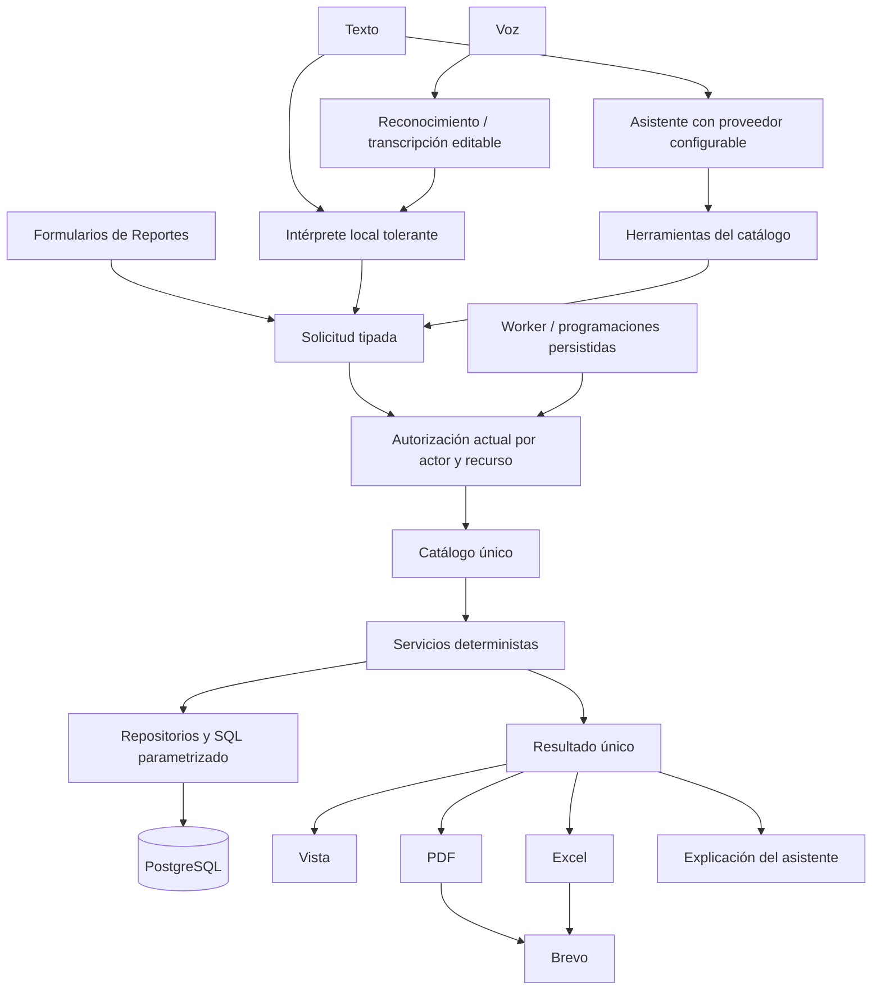

# Plan de implementación: Reportes, solicitudes naturales e IA intercambiable

Fecha: 2026-10-04 (America/La_Paz). Estado: **aprobado; implementación preparada, con activación y aceptación integrada pendientes de entorno**.

Actualización operativa del 2026-10-04: aplicada `20261004_reportes.sql` a la base configurada tras corregir errores de tablas ausentes. Postflight sin tablas pendientes, 57 pruebas aisladas y 47 consultas validadas por EXPLAIN de solo lectura. Worker y entrega real siguen requiriendo activación/prueba operativa. Ver [registro de corrección](decisiones/2026-10-04-tablas-pendientes-reportes.md).

El estado final del código, refinamientos y límites se documentan en [arquitectura de Reportes](ARQUITECTURA_REPORTES_IA.md), [operación](OPERACION_REPORTES.md) y [registro de implementación](decisiones/2026-10-04-implementacion-reportes.md). Este plan se conserva como alcance aprobado; no constituye evidencia de migración aplicada, correo real, concurrencia real o voz probada en dispositivo.

## 1. Resultado que se propone construir

Un apartado Reportes en Angular y Flutter que permita consultar datos, solicitar reportes por texto o voz, descargarlos en PDF/XLSX y enviarlos manualmente o mediante programaciones. Los reportes y sus cálculos funcionarán con la IA deshabilitada. El asistente interpretará solicitudes y utilizará los mismos servicios autorizados que usa el apartado Reportes.

La aprobación de este plan autorizaría desarrollar código, pruebas y migraciones versionadas del alcance descrito. El envío de este plan no ejecuta migraciones, no envía correos, no activa programaciones ni despliega servicios. La activación externa se hará sobre la implementación probada y configuración concreta del entorno autorizado; los correos de prueba usarán destinatarios designados para pruebas.

Referencias de contexto: [arquitectura general](ARQUITECTURA_Y_PATRONES.md), [arquitectura de BD](ARQUITECTURA_BASE_DATOS.md), [inventario](BASE_DATOS_INVENTARIO.md) y [factibilidad HU95–HU113](FACTIBILIDAD_HU95_HU113.md).

## 2. Hallazgos que determinan el diseño

- El backend conserva `routes → services → repos → PostgreSQL`; los módulos tienen mecanismos de tenant diferentes que deben unificarse para este nuevo apartado sin una refactorización masiva de toda la aplicación.
- El `.env` local contiene `DEEPSEEK_API_KEY`, `DEEPSEEK_BASE_URL` y `DEEPSEEK_MODEL`. No se mostraron sus valores. `Config` y `AIService` todavía usan Gemini directamente: el cambio de archivo por sí solo no cambia el proveedor ejecutado.
- `email_service.py` ya integra Brevo para texto, pero no recibe adjuntos ni devuelve un contrato general de entrega de reportes. Se extenderá preservando recuperación de contraseña y correo de prueba.
- Hay comparativo CU17 y datos de stock, asignaciones, avances, unidades e incidencias. Los consumidores antiguos de presupuesto/APU son incompatibles con la base actual y no serán la fuente de los nuevos reportes.
- No se encontró un scheduler persistente ni un servicio general de reportes. El móvil declara `record`, pero grabar audio no implica tener reconocimiento de voz implementado.
- Cliente, jefe, administrador y trabajadores no tienen el mismo ámbito de datos. No basta con limitar un menú por rol: se deben aplicar permisos y relaciones de recursos al generar, descargar y enviar.

## 3. Decisiones arquitectónicas propuestas

### Un catálogo único de capacidades

Crear un `ReportRegistry` con identificadores estables y definiciones de reporte/métrica: descripción, sinónimos, filtros tipados, fuentes, permisos, columnas, alcance por recurso, exportadores y versión del contrato.

Cada definición apunta a un servicio de consulta; la UI, el intérprete local, el asistente y el worker utilizan ese servicio. Los servicios reutilizan consultas existentes cuando son compatibles. Cuando falta una consulta, se añade una consulta parametrizada en el repositorio de dominio correspondiente y se registra como capacidad disponible.

**La IA no recibirá credenciales, conexiones ni una herramienta de SQL arbitrario.** «Llamar una query» significa solicitar una capacidad del backend con filtros validados. Las nuevas consultas serán código revisable del backend, y también quedarán disponibles para el usuario sin IA.

### Contratos compartidos

- `ReportRequest`: reporte, filtros, período y formato. El contexto autorizado de empresa/actor se agrega en el servidor, no se toma como autorización desde el cuerpo.
- `AuthorizedContext`: actor vigente, tenant explícito, permisos actuales y ámbito de obras/unidades/OT/campos.
- `ReportResult`: versión, filtros efectivos, fecha de corte, empresa, moneda, columnas, filas, totales, indicadores y advertencias sobre cobertura de datos.
- `InterpretationResult`: intención, reporte/capacidad, entidades resueltas, filtros, estado `ready`, `needs_clarification` o `unsupported`, y mensaje útil.
- `ReportExecution`: snapshot de solicitud y alcance efectivo, estado, versiones, archivos y entregas.

La vista, el PDF y el Excel de una ejecución usarán **el mismo resultado**. Ejecutar de nuevo después producirá una nueva fotografía identificada, no un archivo con cifras distintas bajo la misma ejecución.

Patrones: Service Layer y Repository existentes; Registry para capacidades; Adapter y Factory para proveedores, voz/exportación/correo; Strategy para interpretación; cola persistente/outbox para trabajos y entregas. No introducir microservicios ni Redis/Celery en la primera versión.

## 4. Alcance del catálogo inicial

| Capacidad | HU | Alcance aprobado si se acepta este plan |
| --- | --- | --- |
| Presupuesto por obra/versión | HU95 | Estimación actual, partidas, cantidades, precios, estado y totales. |
| Comparativo de costos | HU96 | Original, cambios aprobados, revisado, ejecutado y variaciones. Reutilizar CU17. |
| Stock | HU97 | Existencias, mínimo, faltantes y valoración por material/categoría. |
| Salidas de materiales registradas | HU98 parcial | Separar ajustes de inventario y vínculos a obra/OT cuando existan. Etiquetar cobertura; no afirmar consumo físico completo. |
| Asignación de personal | HU99 | Asignaciones actuales por obra/OT/rol y fecha disponible. |
| Carga operativa de personal | HU100 parcial | OT asignadas y estados; no presentar horas o porcentaje de utilización inexistentes. |
| Ejecutivo de avance | HU101 | Estado, fechas, OT finalizadas y último avance por unidad como indicadores separados. No inventar ponderación física global. |
| Estado de unidades | HU102 | Estado constructivo, tipo y proyecto; estado comercial solo como capacidad adicional autorizada de CRM. |
| Incidencias | HU103 | Estado, prioridad, responsable, fechas y tiempos registrados. |
| Incidencias críticas | HU104 | Prioridad CRITICA con filtros de activas e históricas. |
| Métricas naturales | HU105–HU108 | Consulta de las métricas del catálogo; tablas, explicación y acceso al reporte correspondiente. |
| Control de datos | HU109 | Aplicación transversal en consulta, IA, descarga y envío. |
| Sugerencias de costos/compras | HU110–HU111 | Reglas explicables sobre excedentes, stock mínimo y compras pendientes. Se añaden después de estabilizar métricas. |

HU112 y HU113 quedan preparadas como futuras capacidades. La primera entrega no promete reasignación óptima ni predicción validada de retrasos, y no añade en secreto horas de trabajo, consumos físicos o cronogramas completos.

El catálogo es extensible a consultas nuevas. «Cualquier consulta» se trata como una entrada que el sistema atiende de forma útil; no equivale a disponer de datos o cálculos para cualquier tema imaginable.

## 5. Texto y lenguaje natural sin dependencia de IA

Crear un intérprete determinista en español con normalización, acentos, variantes singular/plural, sinónimos de dominio, errores ortográficos, nombres aproximados de recursos **autorizados**, períodos relativos y contexto de conversación.

Implementar coincidencia aproximada con RapidFuzz, más reglas de intención y filtros. Las puntuaciones de similitud no son probabilidades: los umbrales y márgenes entre candidatos se calibrarán con ejemplos reales. [Referencia de RapidFuzz](https://rapidfuzz.github.io/RapidFuzz/Usage/process.html).

Proceso:

1. Detectar acciones: consultar, generar, exportar, enviar o programar.
2. Identificar reporte/métrica y campos: obra, período, estado, prioridad, material, actor y formato.
3. Resolver entidades dentro del ámbito permitido; no usar fuzzy matching para conceder permisos ni cambiar tenant/destinatario silenciosamente.
4. Completar filtros con contexto seguro: obra activa, conversación y preferencias explícitas. Mostrar los filtros aplicados.
5. Si queda una ambigüedad importante, pedir un dato concreto con opciones. Con una falta menor y un candidato claro, continuar y mostrar la interpretación.

Ejemplos previstos:

- «reporte de stok» → Stock.
- «cuanto gastamos en green towr este mes» → Comparativo/costos, obra autorizada resuelta, período del mes; ofrecer la distinción si cambia el resultado.
- «ahora en excel» → Exportación de la ejecución anterior del mismo actor y conversación.
- «incidensias criticas abiertas» → Incidencias CRITICA activas.
- «mándaselo a Juan» → Resolver actor permitido y preparar envío; si hay dos Juan, solicitar selección.
- «hazlo semanal los lunes a las 8» → Preparar programación vinculada al reporte actual y zona horaria.

No responder con el error genérico «No se te entendió». Para faltantes: «Identifiqué el reporte de costos. Elige la obra». Para capacidad inexistente: explicar qué dato falta y ofrecer un reporte disponible. Una solicitud malformada o no autorizada conserva su validación técnica, con mensaje claro.

Los envíos y programaciones expresamente solicitados se ejecutan cuando los campos necesarios y destinatarios están resueltos; no añadir una confirmación repetitiva a cada interacción. Las propuestas inferidas que cambien destinatarios, periodicidad o alcance necesitan aceptación explícita de esa propuesta.

## 6. Voz

La voz alimenta el mismo intérprete de texto y no calcula reportes. Mostrar transcripción editable, permiso de micrófono, estado de escucha y botón para enviar.

- Angular: reconocimiento del navegador cuando esté disponible, activado por botón. La compatibilidad de SpeechRecognition es limitada; no será la única vía de voz soportada. [Referencia del navegador](https://developer.mozilla.org/en-US/docs/Web/API/SpeechRecognition).
- Flutter: adaptador de reconocimiento del dispositivo, inicialmente `speech_to_text`, orientado a comandos/frases cortas. Verificar permisos y soporte Android/iOS. [Documentación del paquete](https://pub.dev/documentation/speech_to_text/latest/index.html).
- Fallback común: grabación y endpoint de transcripción, detrás de un `SpeechProvider` independiente. Proponer Whisper local en un worker con los recursos necesarios; interfaz lista para un proveedor STT externo si se elige posteriormente. No asumir que la API conversacional DeepSeek transcribe audio.

Texto funcionará sin IA ni STT. Voz del dispositivo no dependerá del LLM de reportes, aunque el sistema operativo/navegador puede usar servicios externos. Garantizar voz en navegadores sin reconocimiento requiere desplegar el fallback STT; no se declarará completa esa cobertura sin probarlo.

No guardar audio por defecto; limitar duración/tamaño y eliminar temporal tras transcripción. El historial conserva el texto necesario según retención, no grabaciones indefinidas. Lectura de respuestas por voz puede añadirse con TTS del dispositivo, pero no es requisito de la primera entrega.

## 7. Exportación PDF y Excel

Generar ambos formatos en el backend para que web, móvil y automatizaciones tengan exactamente la misma lógica.

- PDF: ReportLab, portada compacta, empresa, filtros, fecha de corte, indicadores, tablas con cabeceras repetidas, totales y paginación. [Tablas en ReportLab](https://docs.reportlab.com/reportlab/userguide/ch7_tables/).
- XLSX: openpyxl, hojas Resumen/Detalle/Filtros, fechas y números tipados, moneda explícita, encabezados y filtros. Para grandes volúmenes evaluar write-only. [Modos optimizados](https://openpyxl.readthedocs.io/en/stable/optimized.html).
- Exportar todos los registros filtrados autorizados. La paginación de pantalla no define el contenido descargado.
- Conservar Decimal/NUMERIC para cálculos; valores monetarios derivados por el backend, nunca por el LLM. No sumar distintas monedas sin separación/conversión definida.
- Sanitizar texto para evitar fórmulas inyectadas en Excel y markup no confiable en PDF/HTML de correo.
- Archivos medianos/grandes se generan como trabajo; no truncar silenciosamente. Para PDF muy extenso, ofrecer resumen y detalle en XLSX con esa selección explícita.

Valores iniciales propuestos y configurables: archivo hasta 5 MiB para adjunto automático; retención de archivos 7 días; períodos y volumen máximo por reporte definidos en catálogo. Son límites de producto a validar con datos y transporte, no límites atribuidos a Brevo.

## 8. Actores, permisos y privacidad de alcance

Agregar permisos de acción: `Visualizar_reportes`, `Exportar_reportes`, `Enviar_reportes`, `Programar_reportes` y `Administrar_programaciones_reportes`, además del permiso del dominio y del alcance por recurso. La migración identificará nombres existentes/duplicados antes de insertar; no otorgará acceso transversal a todos los dominios por tener acceso al apartado.

Matriz inicial propuesta:

| Actor | Consulta y exportación | Envío/programación |
| --- | --- | --- |
| ADMINISTRADOR | Administración global con tenant explícito para cada ejecución; consolidado global solo como capacidad separada autorizada. | Gestiona programación por empresa; no envía informes globales a actores de una empresa. |
| ADMINISTRADOR_EMPRESA | Reportes de su empresa según permisos de dominio. | Envío a actores autorizados y administración de programaciones propias de empresa. |
| JEFE DE OBRA | Reportes autorizados de obras accesibles; revisar matriz real amplia antes de asignar nuevos permisos. | Programaciones propias sobre su ámbito; sin adquirir permisos de otra empresa. |
| CLIENTE | Avance/estado de sus obras/unidades expresamente vinculadas; excluir costos internos, stock y datos personales de terceros por defecto. | Recibe lo autorizado; envío a su propio correo si tiene permiso. Programación propia limitada a esas capacidades si se habilita. |
| Trabajador | Reportes de sus OT/asignaciones/incidencias accesibles. | Recepción autorizada y envío propio si se habilita; sin administración de empresa. |

Antes de implementar acceso del cliente, resolver una relación canónica y verificable de cuenta → persona → obra/unidad: la FK `t_detalle_obra.id_cliente` apunta a persona, y el CRM es una relación comercial diferente. No usar coincidencia de nombres/correos como autorización.

La consulta normal deriva tenant del actor; el administrador debe seleccionar empresa para operar. No reutilizar fallbacks a empresa 1. Recargar estado/permisos para operaciones sensibles y ejecuciones programadas; no persistir JWT para el worker.

## 9. Envío manual con Brevo

Extender el servicio actual con un contrato de envío de reporte: destinatario, asunto, contenido, adjuntos o vínculo autenticado, identificador de intento y resultado con messageId.

Brevo admite adjuntos con contenido base64 o URL. Se utilizará base64 para adjuntos pequeños; un vínculo a nuestra descarga autorizada para archivos mayores. La aceptación de la API no equivale a entrega al buzón. [Adjuntos y envío](https://developers.brevo.com/reference/send-transac-email), [eventos de entrega](https://developers.brevo.com/docs/transactional-webhooks).

Flujo:

1. El actor selecciona destinatarios del directorio autorizado, evitando direcciones arbitrarias externas en la primera versión.
2. Comprobar emisor, receptor y su relación con empresa/recursos. El receptor es una cuenta autorizada con correo verificado; no buscar únicamente por email.
3. Generar resultado por receptor con alcance máximo igual a la intersección del emisor y receptor. Si el receptor no tiene acceso al reporte, rechazar ese destino; no intentar resolverlo mediante el prompt.
4. Generar archivo individual cuando los ámbitos difieran. No enviar una versión del administrador a todos los receptores ni exponer direcciones en CC.
5. Encolar envío; persistir estado e identificador de proveedor. Un fallo por destinatario no bloquea los demás.

Los estados distinguen pendiente, enviando, aceptado por proveedor, entregado si hay evento verificado, fallo y resultado incierto. Un timeout después de enviar puede dejar resultado incierto: no se promete exactly-once a través de una API externa. Implementar deduplicación local, identidad estable de entrega y reconciliación/reintento compatible con el proveedor.

La consulta inicial no enviará correos por implicación; hace falta una orden manual o programación activada. Los webhooks se registrarán/verificarán de acuerdo con el mecanismo soportado, con correlación e idempotencia; no confiar en un messageId recibido públicamente sin validar su origen.

## 10. Programación y automatización durable

Programaciones diarias, semanales y mensuales; hora y zona horaria IANA, período dinámico, empresa, reporte, filtros, formatos y destinatarios. Propuesta por defecto: `America/La_Paz`. Persistir próxima ejecución en UTC y calcular períodos en la zona configurada.

Para mensualidad sin día existente se propone último día del mes; mostrar esa regla al configurar. Guardar por separado «mes anterior», «semana anterior» o rango fijo para no reutilizar un período accidentalmente.

Worker separado del servidor HTTP, ejecutable localmente y desplegable como proceso de background. Cola y programación en PostgreSQL, usando claim con `FOR UPDATE SKIP LOCKED`, lease, recuperación tras caída y unicidad por programación/fecha/receptor. SKIP LOCKED se usa solo para trabajos, no para calcular reportes. [Documentación PostgreSQL](https://www.postgresql.org/docs/17/sql-select.html).

El worker hace claim en transacción corta, libera locks y genera/envía fuera del lock; renueva lease y persiste resultado. Un fallo reintenta con backoff limitado; validación/permisos/credenciales inválidas no provocan bucles infinitos.

En cada ejecución:

1. Recargar permisos y vigencia del creador y destinatarios.
2. Resolver período y capacidades con la versión correspondiente.
3. Generar resultado nuevo por ámbito de receptor autorizado.
4. Exportar y enviar; registrar intentos y estado.
5. Avanzar programación y mostrar pendientes/fallos en UI.

Si se revoca acceso o la cuenta deja de ser válida, omitir el destinatario y mostrar el motivo al administrador autorizado. Si el creador pierde el permiso de programar o consulta, suspender la programación hasta una nueva asignación autorizada.

Política de interrupción propuesta: recuperar solo la última ocurrencia vencida dentro de la ventana configurada; no enviar de golpe todos los reportes omitidos durante días sin servicio. La UI informa omisiones y permite reejecución explícita.

No iniciar un scheduler independiente en cada worker Uvicorn. El proceso de programación requiere un servicio activo; preparar instrucciones Render background worker/cron según el despliegue que se elija, sin crear infraestructura desde esta planificación. [Workers](https://render.com/docs/background-workers), [cron](https://render.com/docs/cronjobs).

## 11. Persistencia nueva propuesta

Migración incremental de cinco tablas de reportes, sin duplicar las tablas de negocio:

| Tabla propuesta | Propósito y campos principales |
| --- | --- |
| `t_reporte_programacion` | Empresa, creador, reporte/versión, filtros JSONB validados, frecuencia, zona, próxima ejecución, habilitada y estado. |
| `t_reporte_programacion_destinatario` | Programación, actor receptor y preferencias de formato; unicidad por programación/receptor. |
| `t_reporte_ejecucion` | Empresa, actor responsable/receptor cuando corresponda, programación/ocurrencia opcional, solicitud normalizada, alcance efectivo, estado, lease/intentos, fecha de corte, versiones y resumen. |
| `t_reporte_archivo` | Ejecución, formato, nombre, hash, tamaño, bytes o storage key, caducidad y metadatos de alcance. |
| `t_reporte_envio` | Ejecución, receptor, estado, intentos, fecha próxima, identificador estable, messageId y error normalizado. |

Para primera versión con archivos acotados, almacenamiento temporal BYTEA en PostgreSQL mediante `ReportStorage` permite durabilidad entre procesos sin depender de disco efímero o contratar otro servicio. Limitar volumen y retención; adaptador preparado para object storage si escala. La descarga siempre pasa por autorización actual.

FK, CHECK, índices de tenant/estado/next_run y unicidad de ocurrencias/destinos; evitar CASCADE que destruya historial de entregas al borrar una programación. Desactivar cuenta/programación y conservar trazabilidad acorde a retención; no copiar el ON DELETE CASCADE de bitácora como garantía de historial permanente.

Contexto conversacional: dos tablas adicionales propuestas (`t_asistente_conversacion`, `t_asistente_mensaje`) con empresa, actor, expiración y solicitudes/resultados referenciados. Retención configurable de 30 días; estado de filtros/destinatarios separado de mensajes. Revalidar alcance al retomar conversación y borrar contexto al cambiar tenant. No guardar secretos ni resultados completos indiscriminadamente.

Antes de aplicar, comprobar esquema actual, integridad y datos de catálogos; generar migración y reversión revisables. No asumir que la fotografía previa sigue idéntica.

## 12. Arquitectura de IA única e intercambiable

`AIProvider` expone `interpret_request`, `complete` y negociación de capacidades de salida estructurada/tool calls. Factory por configuración `AI_PROVIDER`, modelo, endpoint, timeout y límites. Inicialmente implementar DeepSeek y adaptar Gemini existente detrás del mismo contrato, preservando consulta CRM.

Mapear las variables `DEEPSEEK_*` actuales; añadir selector explícito y configuración común sin reescribir ni mostrar credenciales. Cambiar modelo dentro de un proveedor mediante env; cambiar protocolo/proveedor mediante adaptador. «Intercambiable» no significa que cualquier API incompatible funcione sin adaptador.

DeepSeek documenta llamadas a herramientas y formatos compatibles, por lo que puede proponer capacidades tipadas. Validar siempre respuestas y filtros en el backend, independientemente de modos estrictos del proveedor. [API DeepSeek](https://api-docs.deepseek.com/), [herramientas](https://api-docs.deepseek.com/guides/tool_calls/).

El orquestador:

- Ofrece solo las capacidades potencialmente autorizadas del actor, y vuelve a autorizar cada ejecución real.
- Usa el intérprete local primero para solicitudes claras; el proveedor ayuda con lenguaje complejo y explicación.
- Ejecuta solicitudes tipadas del catálogo, con límite de herramientas, tiempo, tamaño y costo.
- Devuelve cifras/filtros/referencias provenientes de `ReportResult` y redacta acorde al actor, evitando revelar columnas excluidas.
- Conserva contexto de diálogo para «el mismo proyecto», «ahora este mes» y «en PDF» con validación por sesión/actor/empresa.
- Trata mensajes/datos de negocio como contenido, no como instrucciones para ampliar permisos o enviar correos.
- Si el proveedor falla, mantiene reportes, exportación, interpretación local y automatizaciones funcionando; devuelve la explicación determinista y permite continuar.

Envíos y programaciones no estarán como herramientas mutadoras libres: el asistente prepara la intención y el servicio de acciones la valida/ejecuta como lo hace la UI. Los archivos y decisiones de envío no dependen del texto libre generado.

No colocar SQL en nuevos context builders para cada modelo. Reutilizar capacidades existentes; adaptar gradualmente el CRM a su servicio de consulta, preservando contratos y evitando duplicar reglas en cada proveedor.

## 13. API y archivos previstos

Rutas propuestas, a fijar en contrato durante la primera fase:

- `GET /api/reportes/catalogo`: catálogo filtrado para el actor.
- `POST /api/reportes/interpretar`: texto/continuación a solicitud estructurada, sin efectos externos.
- `POST /api/reportes/ejecuciones`: generar/encolar reporte.
- `GET /api/reportes/ejecuciones/{id}`: resultado/estado autorizado.
- `POST /api/reportes/ejecuciones/{id}/exportaciones`: solicitar PDF/XLSX del mismo resultado.
- `GET /api/reportes/archivos/{id}`: descarga protegida.
- `POST /api/reportes/ejecuciones/{id}/envios`: envíos manuales autorizados con regeneración por destinatario cuando sea necesaria.
- `GET/POST/PATCH /api/reportes/programaciones`: listar/crear/editar/pausar programaciones dentro del ámbito.
- `POST /api/reportes/programaciones/{id}/ejecutar`: ejecución manual con identidad de ocurrencia independiente.
- `POST /api/voz/transcribir`: fallback STT configurado.
- `POST /api/ai/consulta`: asistente general; conservar rutas de CRM existentes.

Componentes previstos: `reportes_routes.py`, `reportes_services.py`, `reportes_repos.py`; subpaquetes de catálogo, interpretación, autorización, exportadores, almacenamiento y programación; `AIProvider`/factory/adaptadores; adaptador de voz; worker de reportes; ampliación de `email_service.py`.

Angular: página Reportes con catálogo, filtros, consulta natural/micrófono, tabla, indicadores, descarga, envío, historial y programaciones. Flutter: pantalla equivalente usando los mismos servicios API, reconocimiento, descarga/compartir archivos y estado de trabajos. Mantener patrones UI existentes; el diseño visual detallado se prepara al implementar la fase de interfaz.

## 14. Fases y puertas de aceptación

| Fase | Entrega concreta | Criterio para continuar |
| --- | --- | --- |
| 1. Contratos y HU109 | Catálogo, contexto autorizado, matriz de acciones/recursos, migraciones propuestas y pruebas de aislamiento. | Actor/tenant/permisos no pueden ampliarse desde UI, IA, descarga o destinatario; relación cliente resuelta. |
| 2. Reportes deterministas | Consultas y cálculos del catálogo inicial, compatibilidad CU17, cortes/versiones y API. | Mismas cifras para solicitudes equivalentes; sin IA; cobertura de campos y unidades explicitada. |
| 3. PDF/XLSX y consulta local | Exportadores, intérprete tolerante y pruebas de frases, fechas y filtros. | Reporte, PDF y Excel coinciden; errores de una letra no bloquean casos claros; ambigüedades importantes se resuelven. |
| 4. Interfaz web/móvil y voz | Apartado Reportes, solicitud, filtros, descargas y adaptadores de voz/fallback. | Flujos de actores probados y comandos de voz/texto equivalentes en plataformas soportadas. |
| 5. Brevo y automatización | Extensión compatible de correo, cola/worker, programaciones, destinatarios, recuperación y estados. | Sin duplicados locales ante concurrencia; revocación bloquea envío; reinicios y resultados inciertos se manejan; correos de prueba controlados. |
| 6. IA configurable | DeepSeek/Gemini mediante contrato único, herramientas de catálogo, conversación y explicación. | Mismas fuentes que Reportes; cambio de proveedor sin tocar reglas; fallo LLM no rompe reportes; CRM mantiene contrato. |
| 7. Recomendaciones y cierre | HU110–HU111 básicas, auditoría, documentación y manual de operación. | Recomendación con evidencia; no inventar consumos/capacidad/pronósticos; aceptación integrada y límites documentados. |

La automatización de interpretación amplia depende de fase 6, pero los envíos periódicos de solicitudes ya estructuradas no dependen del LLM. La voz transcribe a texto y no exige fase 6 si el intérprete local resuelve el comando.

No estimar días exactos antes de validar criterios de cliente, volumen de datos y recursos STT/worker. Cada fase produce una entrega revisable y su registro Markdown, no una implementación monolítica al final.

## 15. Pruebas y aprobación

Pruebas significativas previstas:

- Aislamiento por empresa/obra/unidad/actor en consulta, archivo, sesión de diálogo y envíos; cambios de rol y destinatario antes de ejecución.
- Casos de datos vacíos, sin línea base, columnas NULL, varias monedas, estados y datos legacy incompatibles.
- Integridad de cantidades/totales entre API, PDF y XLSX, volumen completo y texto malicioso.
- Corpus de frases españolas, typos, sinónimos, nombres cercanos, período relativo y continuación; preguntas fuera de catálogo con alternativa útil.
- Dos workers, lease vencido, caída tras claim, pausa, reintentos, ocurrencias omitidas y timeout del correo con resultado incierto.
- Adaptadores de IA con dobles de proveedor, filtros inválidos/tool calls desconocidas, autorización independiente y fallback sin IA.
- Compatibilidad de recuperación de contraseña/Brevo y consulta CRM existentes.
- Voz en dispositivos/navegadores soportados, micrófono denegado y fallback STT, con igualdad de intención frente a texto.

Se propone aprobar este alcance: catálogo inicial con límites explícitos, backend determinista compartido, Angular y Flutter, texto tolerante, voz con fallback desplegable, PDF/XLSX, Brevo manual/programado, worker PostgreSQL y adaptadores DeepSeek/Gemini. Las futuras métricas que necesiten nuevas capturas se definirán aparte sin afirmar que sus datos ya existen.

Pendientes de entorno para activación: proceso worker disponible, recursos de STT si se exige cobertura de voz completa, dominio/URL del webhook si se habilita estado entregado, remitente Brevo y destinatarios de prueba. Estos no impiden desarrollar los contratos, consultas, interfaz y pruebas aisladas.

Este documento es la propuesta concreta para aprobación solicitada por el usuario. La arquitectura actual no se considera reemplazada hasta implementar y verificar las fases correspondientes.
